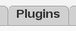
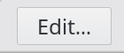
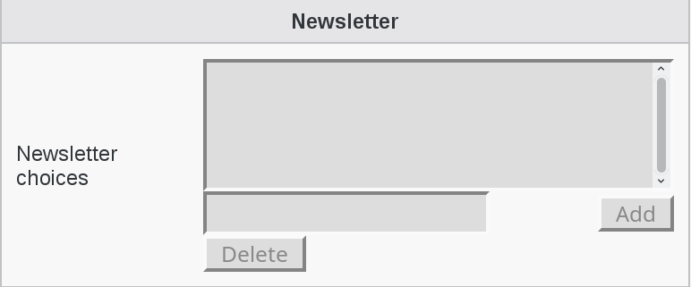

Configuration
=============

If you need to modify something, you can access to FD configuration of the plugin by the 'Configuration' icon or entry in the 
'Addons' section of the main page of FusionDirectory Configutation Interface: 

.. image:: images/newsletter-configuration.png
   :alt: Picture of Newsletter configuration in FusionDirectory
   
Go to Plugins tab

   
   
Click on Edit button bottom right 

Go to Newsletter choices and fill-il as required

Click OK to save your settings

.. image:: images/newsletter-ok.png
   :alt: Picture of Ok button in FusionDirectory 

