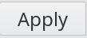

.. include:: /globals.rst

Functionalities
===============

* Enable NextCloud account for a user

Click on Users icon in FusionDirectory

Select a user

.. image:: images/nextcloud-user.png
   :alt: Picture of User line in FusionDirectory

Go to NextCloud tab

Click on Add NextCloud settings button

Fill-in NextCloud account

Available attributes:
  * File quota: quota allowed for user in NextCloud
  * Home folder: to override default NextCloud home folder

.. tip::

    These attributes (``fdNextCloudQuota`` and ``fdNextCloudHomeFolder``) need then to be configured on NextCloud side, see `NextCloud administration manual`_.

.. _NextCloud administration manual: https://docs.nextcloud.com/server/latest/admin_manual/configuration_user/user_auth_ldap.html#special-attributes

Click on Apply button bottom right to save your settings 

