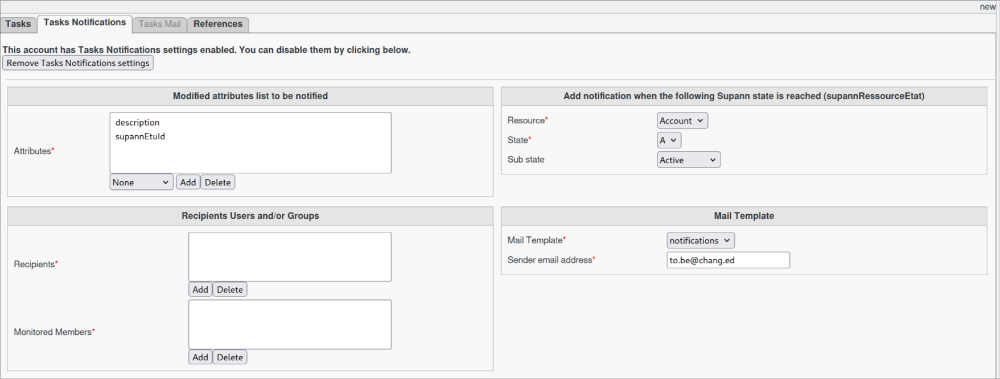

Notifications
=============

The **Notification** task allows you to defined specific attributes you wish to monitor.
If a modification (not a creation), happens to the selected attribute, a notification via email can be send.

Notifications also allows to monitor supann resource.
The supan resource targeted is configurable and a notification will be sent when the supann resource is **entering that specific**
state.

.. note::
   It must be used with FusionDirectory Orchestrator.

Task Setup
----------

Creating the Task
-----------------

- Open the Tasks section in FusionDirectory.
- Define the task’s schedule and repetition interval.

   .. image:: images/notifications-t1.png
      :alt: Life cycle - Task creation step 1
      :width: 600px

Configuring Task Notifications
------------------------------

**Navigate** to the **Tasks Notifications** tab.
**Select** the attributes to monitor.

   .. warning::
      The list of attributes **must be** configured via the **FusionDirectory configuration menu** under the **Notifications** tab before use.

**Choose** the email template to use.
   - The template **must be pre-created**.
   - Specify the sender of the notifications.
**Assign** the relevant monitored members.
   - These members will be analyzed against the defined attributes in audit logs for any modifications **since the last execution of the task**.
**Specify** the recipients who will receive the notifications.
 **(Optional)** Enable monitoring of a **Supann resource**.
   - This allows notifications to be sent when a member reaches a specific Supann state.
   - You can choose to monitor both attributes and Supann resources or only one of them.

.. note::
   You can select either a **static group** or a **dynamic group** for greater flexibility.

Task Execution
--------------

For your configured task to be executed, you need to configure your fusiondirectory-orchestrator-client

See :ref:`Notifications Task Execution <notifications-task-execution-label>`. for more information.

.. important::
   Notifications relies on the last executable date.
   When running the task for the first time, no previous executable date exists.
   As a protective measure, you must execute the task manually once to create an
   initial "last execute" timestamp. This timestamp will serve as the basis for
   triggering notifications in subsequent executions.

Summary
-------

Once configured as described, the **Task Notification** will:

- **Analyze** the monitored attributes **hourly**.
- **Analyze** the monitored Supann states **hourly**.
- **Send** an email notification based on the predefined settings.
