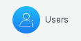
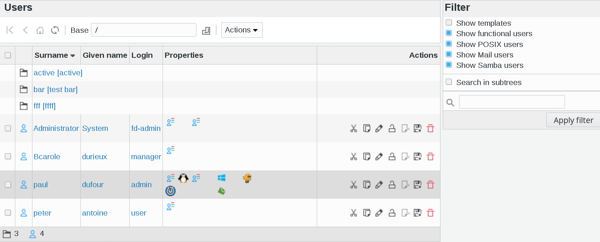
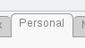
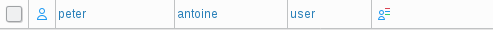
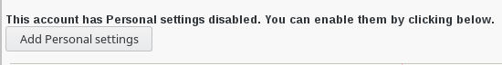
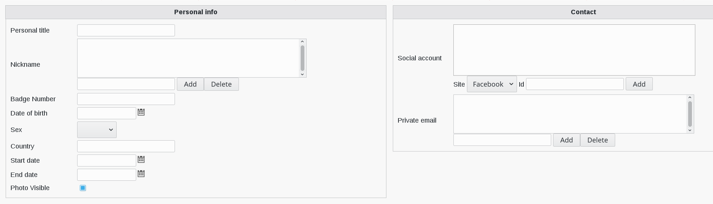
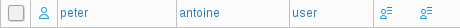

.. include:: /globals.rst

Functionalities
===============

* Edit a user

In FusionDirectory, click on users icon

   
This will bring you to the users overview

Click on a user and go to Personal tab

In this example, I selected peter antoine's profile

   

Activate the personal tab, fill it like you want and save it

   

   

Click on "Apply" button bottom right
   

Now, if you go back to user list, you will see a new icon that defines that personal plugin is activated for your user   
   

