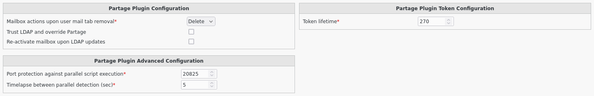

Configuration
=============

If you need to modify something, you can access to FD configuration of the plugin by the 'Configuration' icon or entry in the 
'Addons' section of the main page of FusionDirectory Configutation Interface: 

.. image:: images/renater-partage-configuration.png
   :alt: Picture of Configuration icon in FusionDirectory

Access to configuration is read-only. If you need to make changes, then you must press the 'Edit' button at the bottom right of the window.

In Renater-Partage tab you will find the configuration of the plugin

   
Renater-Partage settings

* Mailbox actions upon user mail tab removal : (required) Option to take in case of user mail tab removal

* Trust LDAP and override Partage : Option to override Partage with LDAP data

* Re-activate mailbox upon LDAP updates : Option to re-activate mailbox if updates are pushed from LDAP

* Port protection against parallel script execution :  (required) Set the TCP port to be used for the protective socket against parallel script execution

* Timelapse between parallel detection (sec) :  (required) Set the required timelapse to respect after a parallel script detection

* Token lifetime : (required) Defines lifetime of the access token in seconds. Max 4min59 (required)
