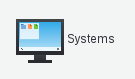
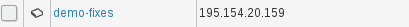
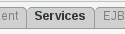
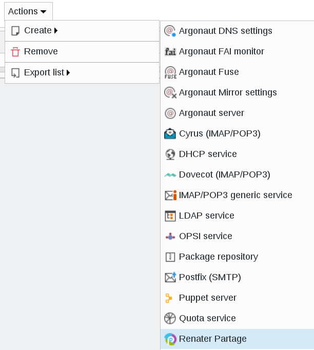
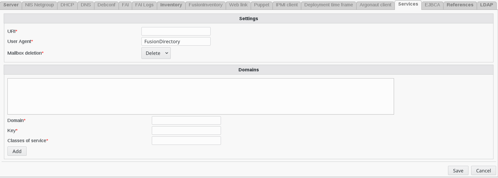
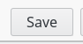
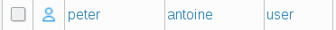
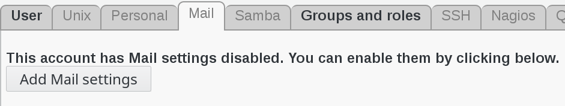

.. include:: /globals.rst

Functionalities
===============

Add Renater Partage service
^^^^^^^^^^^^^^^^^^^^^^^^^^^

Go to Systems 

Create your server or edit an existing server 

Click on services tab 

   
Add the Renater Partage service

Fill the fields for the Renater plugin and save it

   
* Global settings : 

   * URI: url of the webservice
   * User Agent: name of the user agent
   * Mailbox deletion: should i delete the mailbox after removing the account
   
* Per domains settings : 

   * Domain: mail domain ex: acme.com
   * Key: API key received from Renater   
   * Class of service: Service class name | cos id (zimbra cos id)
   
Click on "save" button bottom right to save your server       

   
Add Renater Partage to a user 
^^^^^^^^^^^^^^^^^^^^^^^^^^^^^

Click on "users" button in FusionDirectory main page      

Select a user

Go to Mail tab and click on "Add mail settings"

   
Fill in all the required information : mail account and other addresses and redirections

.. image:: images/renaterpartage-mail-account-info.png
   :alt: Picture of mail account entries in FusionDirectory 

.. image:: images/renaterpartage-other-addresses.png
   :alt: Picture of other addresses entries in FusionDirectory    
   
Click on "Apply" button bottom right to save your settings

