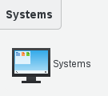
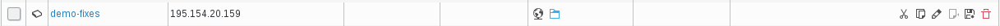
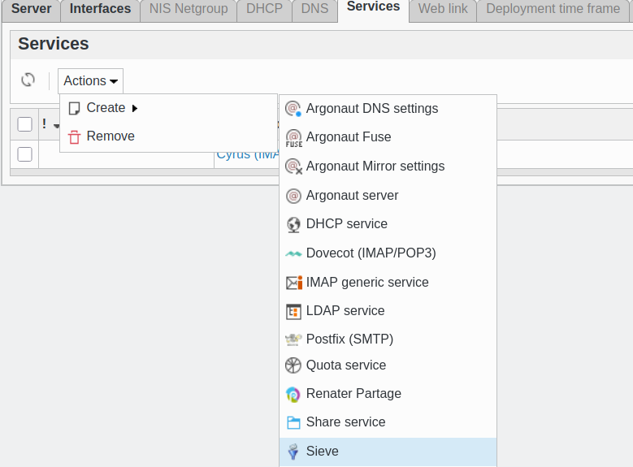
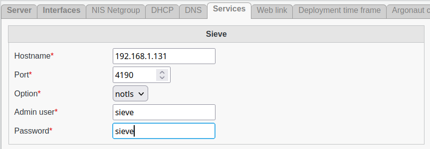

.. include:: /globals.rst

Functionalities
===============

* Add sieve service

Click on the System button located in the System section of FusionDirectory main page

   
   
Click on the server you wish to configure sieve service, in this exemple we assume that the server name is 'demo-fixes'

   
   
Click on 'Services' tab and click on 'action - create - Sieve:    

   
   
Fill in required fields then click 'Save': 

   
   
Sieve settings

    * Hostname: Hostname of the Sieve server.
    * Port: Port number on which Sieve server should be contacted.
    * Option: (required) Options for contacting Sieve server. Valid values are notls, tls and ssl.
    * Valide certificats: Whether or not to validate server certificate on connexion. Valid values are validate and no-validate.
    * Admin user: (required) sieve server admin user.
    * Password: (required) Admin user password.
    
Click on 'save'

Now, in services column, you can see the sieve icon:     

   
   

    
   

