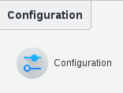
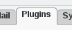

Configuration
=============

If you need to modify something, you can access to FD configuration of the plugin by the 'Configuration' icon or entry in the 
'Addons' section of the main page of FusionDirectory Configutation Interface: 

   
Click on Plugins tab

   
Click on Edit button bottom right and fill in SOGo settings

.. image:: images/sogo-edit-button.png
   :alt: Picture of Edit button in FusionDirectory 
   
   
SOGo RDN : (required) Branch in which SOGo resources will be stored        

   
Click on Ok button bottom right to save settings

.. image:: images/sogo-ok.png
   :alt: Picture of Ok button in FusionDirectory   
   
   

