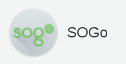
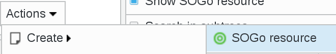
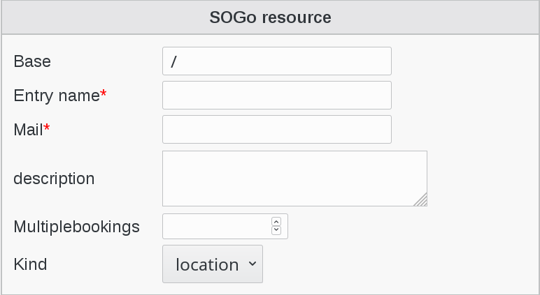
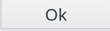

.. include:: /globals.rst

Functionalities
===============

* How to use SOGo plugin

In your FusionDirectory web interface you have now, in the “Systems” section, click on SOGo icon

Click on Actions --> Create --> SOGo resource

Fill-in the required information

   
Click on Ok button bottom right to save your settings

