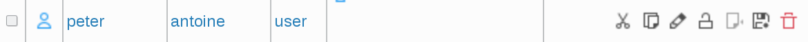
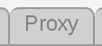
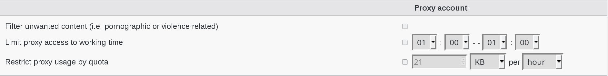
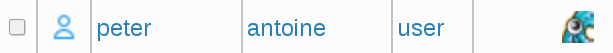

.. include:: /globals.rst

Functionalities
===============

* Create Squid User

Click on Users icon in FusionDirectory

.. image:: images/squid-users.png
   :alt: Picture of Users icon in FusionDirectory

Click on an existing user

Click on “Proxy” tab

   
Click on “Add Proxy Settings” button

   
Fill the desired fields then click “Ok” to save   

Proxy account

   * Filter unwanted content (i.e. pornographic or violence related) : Check if you want enable filtering unwanted content (i.e. pornographic or violence related) for this user.  
   
   * Limit proxy access to working time : Check if you want enable limit proxy access to working time. Choose the start and the end of working time beside, once enabled.  
   
   * Restrict proxy usage by quota : Check if you want enable restrict proxy usage by quota. Choose the quota amount beside, once enabled.  
   
Now, in Properties tab, you can see the squid icon 

   
   

