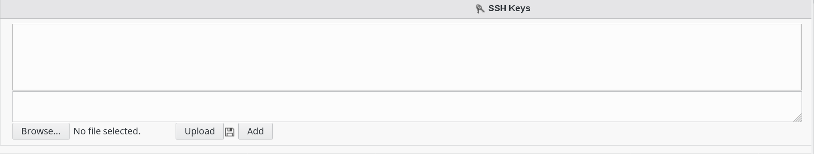

.. include:: /globals.rst

Functionalities
===============

* Create SSH user

Click on Users icon in FusionDirectory

.. image:: images/ssh-users.png
   :alt: Picture of Users icon in FusionDirectory

Click on a user

.. image:: images/ssh-user.png
   :alt: Picture of Supann establishement in FusionDirectory

Click on SSH Tab

   
Click on "Add SSH settings" button

Load the user's ssh public key and click “Add” to upload the key 

   
Click on "Ok" button bottom right to save your settings 

   
Now, in Properties tab, you can see the ssh icon 

