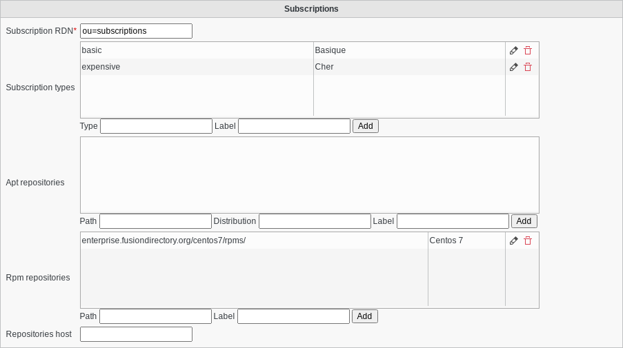

Configuration
-------------

Subscriptions
^^^^^^^^^^^^^

* Subscription RDN
   * Branch in which subscriptions will be stored

* Subscription types
    * Type: Subscription type
    * Label: Label shown for this type
* Apt repositories
    * Path: Repository path
    * Distribution: Distribution name
    * Label: Label shown for this repository
* Rpm repositories
    * Path: Repository path
    * Label: Label shown for this repository
* Repositories host
    * Host for the repositories, to use in auth.conf
