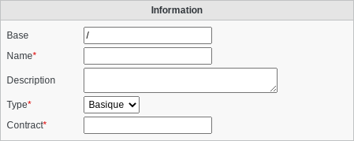
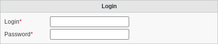
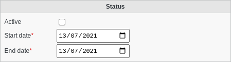
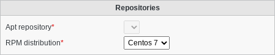
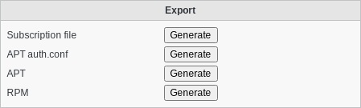

Subscription
============

A subscription object stores the information about the subscription of a client.

Information
^^^^^^^^^^^

* Base: Object base
* Name: Name to identify this subscription
* Description: Description of this subscription
* Type: Subscription type
* Contract: Contract identifier from Dolibarr

Login
^^^^^

* Login: Login for this subscription
* Password: Password

Status
^^^^^^

* Active: Whether this subscription is active
* Start date: Start date of this subscription
* End date: End date of this subscription

Repositories
^^^^^^^^^^^^

* Apt repository: Apt repository
* RPM distribution: RPM distribution

Export
^^^^^^

The "Export" section allows generating files for FusionDirectory and package managers to send to the client.

* Subscription file: Generate the subscription file to send to the client
* APT auth.conf: Generate the auth.conf file to send to the client if he uses Debian or a derivate
* APT: Generate the fusiondirectory-subscription.list file to send to the client if he uses an Apt based distribution
* RPM: Generate the fusiondirectory-subscription.repo file to send to the client if he uses an RPM based distribution

