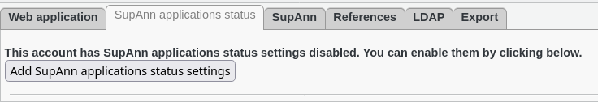
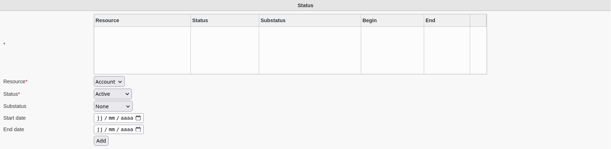
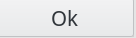

.. include:: ../../../../globals.rst

SupAnn Applications Status
--------------------------

You can activate the SupAnn tab on web applications to turn it into a SupAnn Application.

Go to SupAnn tab and click on ""Add SupAnn status settings" button

You will now see the Status Settings menu to fill

Fill-in the following fields :

* **Resource** : which resource this state concerns (required)
* **Status** : active status (required)
* **Substatus** : substatus
* **Start date** : date this status started
* **End date** : date this status will end

You can also set the start date and end date of the current status for a resource.

Click on "OK"button bottom right to save your settings

