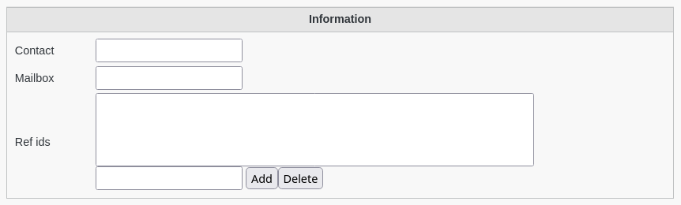
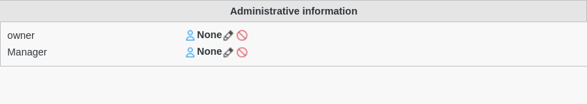

SupAnn Applications
-------------------

You can activate the SupAnn tab on web applications to turn it into a SupAnn Application.

Go to SupAnn status tab and click on ""Add SupAnn status settings" button

Then you can fill the following fields:

Information
^^^^^^^^^^^

* Contact: Contact email address, internal or external to the institution
* Mailbox: Email address of the mailbox assigned to the application
* Ref ids: supannRefId -  unique reference(s) for the application in other databases, for example in the application manager

Administrative information
^^^^^^^^^^^^^^^^^^^^^^^^^^

* Owner:  DN of the owner (administrative manager) of the application
* Manager:  DN of the application's technical manager

