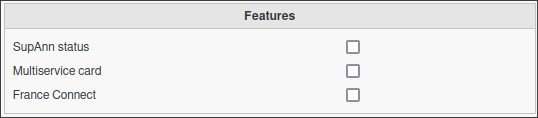

Configuration
=============

SupAnn standard (2020) documentation can be found `here <https://services.renater.fr/documentation/supann/supann2020/recommandations2020/index>`_.

Additionally, the SupAnn standard specifies how to fill the `cn` attribute: `SupAnn CN Attribute Documentation <https://services.renater.fr/documentation/supann/supann2018/recommandations2018/attributs/cn>`_.

You can modify how FusionDirectory renders the `CN` attribute by adjusting the **CN Pattern** in the configuration backend.

For more details, refer to :ref:`configuration_people_and_group_storage`.

The default pattern is:

.. code-block:: text

   %t[fr_FR]|sn% %t[fr_FR]|givenName%

This pattern determines how the `cn` attribute is structured within FusionDirectory.

Configure SupAnn Options
------------------------

1. Click on the **Configuration** icon on the FusionDirectory main page.

   .. image:: images/supann-configuration-icon-main.png
      :alt: Configuration icon in FusionDirectory

2. Navigate to the **SupAnn** tab.

   .. image:: images/supann-tab.png
      :alt: SupAnn tab in FusionDirectory

3. Click the **Edit** button at the bottom right.

   .. image:: images/supann-edit-button.png
      :alt: Edit button in FusionDirectory

4. The SupAnn configuration menu will appear:

   .. image:: images/supann-configuration-menu_1.png
      :alt: SupAnn configuration menu in FusionDirectory

- **SupAnn RDN**: Defines the branch where SupAnn structures will be stored (**required**).
- **SupAnn Mail for Recovery**: Enables password recovery using email addresses from the personal mail field in a SupAnn account.
- **Show mailForwardingAddress Field**: Displays the **mailForwardingAddress** attribute, making it available and editable in individual user configurations.
- **Custom supannMailPrivee Types**: Allows you to define a **Type** and a **Label** for private email addresses, following SupAnn guidelines.
- **Custom supannTelephonePrive Types**: Enables defining a **Type** and a **Label** for private phone numbers, in accordance with SupAnn standards.
- **Custom supannAdressePostalePrivee Types**: Permits the definition of a **Type** and a **Label** for private postal addresses, ensuring compliance with SupAnn guidelines.
- **SupAnn Civilité**: Expands available titles beyond "M." and "Mme." to provide greater inclusivity, following SupAnn recommendations.

Configure SupAnn Resources
--------------------------

**Overview of Supann Resources configuration section**

   .. image:: images/supann-configuration-menu_2.png
      :alt: SupAnn configuration menu in FusionDirectory

**In order to configure a new resource:**
    1. Fill in the appropriate fields as shown below.
    2. Click **Add**.

   .. image:: images/supann-example-library.png
      :alt: Example of resource label configuration in FusionDirectory

- **Substates**: Specifies the allowed substates for an account.
  There are three types:

  - **Active**
  - **Inactive**
  - **Suspended**

- **Custom Labels**: Defines labels for custom substates.

*Example: Adding a "Lost" Substate*

To add the substate **Perdu** (Lost) under the "Library" resource:

   .. image:: images/supann-example-substatus.png
      :alt: Example of substatus label configuration in FusionDirectory

Once all settings are configured, click **OK** at the bottom right.

Configure SupAnn Multiservice Card
----------------------------------

The **Multiservice Card** settings allow configuration of various card-related parameters.

**Overview:**

.. image:: images/supann-multiservice-card-settings_2.png
   :alt: Multiservice Card settings continuation in FusionDirectory

**Configuration Options:**

- **Card Types**: Defines available card types and their labels. Prefix non-standard types with `{ORIGIN}`.
- **Card Sources**: Specifies possible sources for multiservice cards using the format `system@domain`.
- **Card Formats**: Lists allowed formats for multiservice cards.
- **Card Application Domains**: Defines the domains in which card applications are valid.

Configure SupAnn Consent
------------------------

The following configuration allows you to define **consent objects** and **consent types** within SupAnn.

**Steps to Configure Consent:**

1. **Consent Object**: Add a new **Object** such as `"PNGPHOTO"` and specify its related **Label**. Click "Add".
2. **Consent Types**: Add a **Type** with its corresponding **Label** as shown in the example. Click "Add".

💡 **Important:** Click **"Apply"** or **"OK"** at the bottom right of the page to validate all new entries.

Configure SupAnn Features
-------------------------

The **Important Features** panel allows activation or deactivation of specific features on the individual user configuration page.

*Default Enabled Features* :

- **SupAnn Status**: Assigns a designated status to accounts for linked resources.
- **Multiservice Card**: Ensures seamless card integration.
- **FranceConnect**: Facilitates authentication via FranceConnect.

You may enable or disable these SupAnn features based on your requirements.