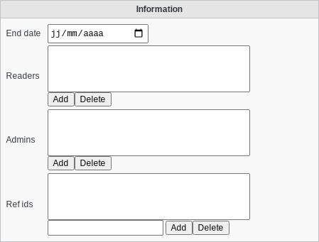

SupAnn Groups
-------------

You can activate the SupAnn tab on any user group, POSIX group, or role to turn it into a SupAnn group.

Open the group, go to SupAnn tab anc click on "Add SupAnn settings" button

.. image:: images/supann-add-supann-settings.png
   :alt: Picture of "Add SupAnn settings" button in FusionDirectory

Then you can fill the following fields:

Information
^^^^^^^^^^^

* End date: Date at which the validity of this group ends
* Readers: Users or groups allowed to read the member list of this group
* Admins: Users or groups allowed to edit this group
* Ref ids: supannRefId - IDs/links for this user on other systems

Note that the «End date», «Readers», and «Admins» fields are specific to SupAnn specification and will not be used by FusionDirectory or openldap to apply rights to users (to do so, see :ref:`fd-acls` instead).
