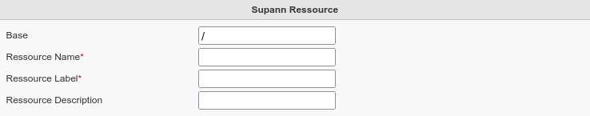
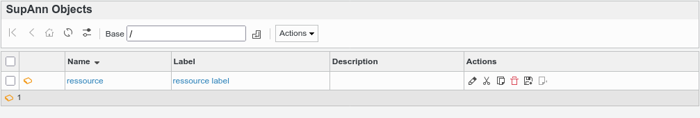

.. include:: ../../../../globals.rst

SupAnn Ressource
================

* Create a Supann Ressource

Click on Supann Objects icon on FusionDirectory main page

.. image:: images/supann-objects-icon-main.png
   :alt: Picture of Supann Objects icon in FusionDirectory

Click on Actions --> Create --> Supann Ressource

Fill-in the following fields :

* **Ressource Name** : name of the ressource
* **Ressource Label** : label of the ressource that will be shown in FusionDirectory
* **Ressource Description** : description of the ressource

