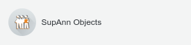
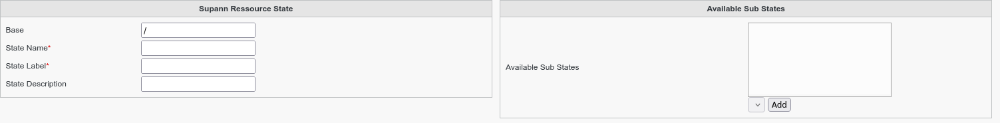
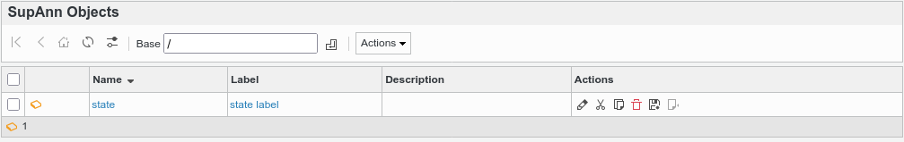

.. include:: ../../../../globals.rst

SupAnn States
================

* Create a Supann State

Click on Supann Objects icon on FusionDirectory main page

Click on Actions --> Create --> Supann State

Fill-in the following fields :

* **State Name** : name of the state
* **State Label** : label of the state that will be shown in FusionDirectory
* **State Description** : description of the state
* **Available Sub States** : substates available for the state

