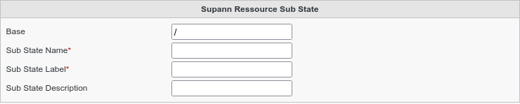

.. include:: ../../../../globals.rst

SupAnn Sub States
=================

* Create a Supann Sub State

Click on Supann Objects icon on FusionDirectory main page

.. image:: images/supann-objects-icon-main.png
   :alt: Picture of Supann Objects icon in FusionDirectory

Click on Actions --> Create --> Supann Sub State

Fill-in the following fields :

* **Sub State Name** : name of the sub state
* **Sub State Label** : label of the sub state that will be shown in FusionDirectory
* **Sub State Description** : description of the sub state
