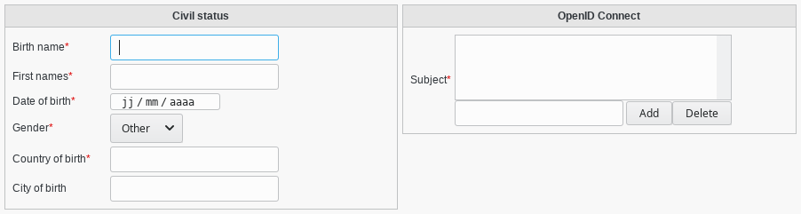

.. include:: ../../../../globals.rst

France Connect
--------------

There is a France Connect tab that you can activate on users to use SupAnn France Connect fields.

Civil status
^^^^^^^^^^^^

* Birth name: Last name from birth
* First names: Space separated first names
* Date of birth: Date of birth
* Gender: Gender
* Country of birth: INSEE code of country of birth
* City of birth: INSEE code of city of birth, if in France

OpenID Connect
^^^^^^^^^^^^^^

* Subject: Subject from OpenID Connect standard in the France Connect system
