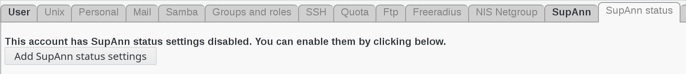
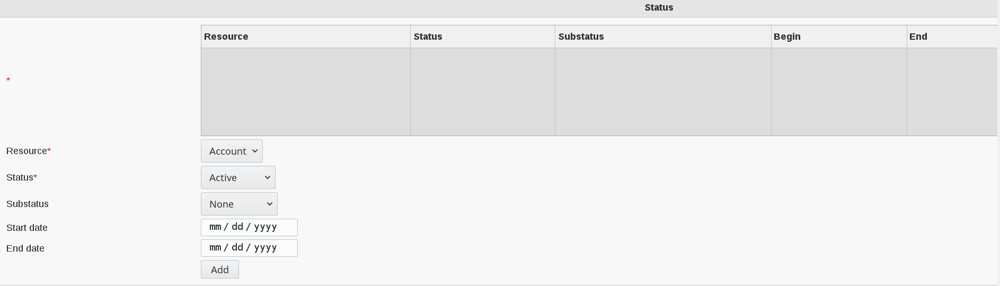

.. include:: ../../../../globals.rst

SupAnn Status
=============

The plugin also adds a tab on users to see/set the current state of their resources.
Default available resources are the mail account and the account itself.

Go to SupAnn status tab and click on ""Add SupAnn status settings" button

You will now see the Status Settings menu to fill

Fill-in the following fields :

* ***** : State of the account and associated resources (required)
* **Resource** : which resource this state concerns (required)
* **Status** : active status (required)
* **Substatus** : substatus
* **Start date** : date this status started
* **End date** : date this status will end

You can also set the start date and end date of the current status for a resource.

If you set an end date, you either have to change the status yourself or use our tool **argonaut-user-reminder** with the option **--supann-update**.

**argonaut-user-reminder** should run daily to keep the status consistent.

Click on "OK"button bottom right to save your settings

.. image:: images/supann-user-ok-button.png
   :alt: Picture of OK button in FusionDirectory
