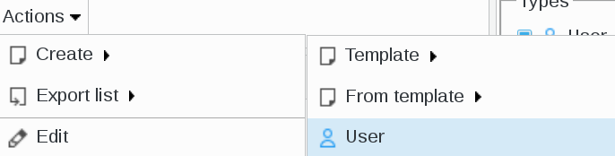

.. include:: ../../../../globals.rst

SupAnn Users
============

* Create a user with SupAnn informations

Click on Users icon on FusionDirectory main page

.. image:: images/supann-user-users-icon-main.png
   :alt: Picture of Users icon in FusionDirectory

Click on Actions --> Create --> User

Go to SupAnn tab anc click on "Add SupAnn settings" button

.. image:: images/supann-user-add-supann-settings.png
   :alt: Picture of "Add SupAnn settings" button in FusionDirectory

Identity

Fill-in the following fields :

* **Civilite** : supannCivilite - Civility of this person
* **Alias login** : supannAliasLogin : AN alias for the login of this user
* **eduPersonPrincipalName** : eduPersonPrincipalName - A name that looks like <id>@<domain> which is unique for this domain, and has not been assigned to anyone else recently
* **Nickname** : eduPersonNickname - Can contain a nickname for this user
* **Ref ids** : supannRefId - IDs/links for this user on the other systems

Contact

.. image:: images/supann-user-contact-settings_1 .png
   :alt: Picture of SupAnn contact settings in FusionDirectory

.. image:: images/supann-user-contact-settings_2 .png
   :alt: Picture of SupAnn contact settings in FusionDirectory

Fill-in the following fields :

* **Other phone numbers** : supannAutreTelephone - Other phone numbers for this user
* **Private phone numbers** : supannTelephonePrive - Private phone numbers for this user
* **Other email addresses** : supannAutreMail - Other e-mail addresses for this users . Each must be unique
* **Personal email addresses** : supannMailPerso - Personal e-mail addresses for this user
* **Private email addresses** : supannMailPrive - Private e-mail addresses for this user
* **Private addresses** : supannAdressePostalePrivee - Private addresses for this user
* **Red list** : supannListeRouge - Should this person be on the red list (required)

Assignment

Fill-in the following fields :

* **Primary assignment** : supannEntiteAffectationPrincipale - Main assignment of the person
* **Assignments** : supannEntiteAffectation - Reprents assignments of the person in an institution, a component, service, etc.
* **Entity types** : supannTypeEntiteAffectation - TYpes of the entities this person is assigned to

Student profile

Fill-in the following fields :

* **INE code** : supannCodeINE - INE code of this student
* **Student ID** : supannEduId - Scolarity id

Affiliation

Fill-in the following fields :

* **Primary affiliation** : eduPersonPrimaryAffiliation - Main status of the person
* **Affiliations** : eduPersonAffiliation - Status of the person : student, BIATOSS, teacher, contract, retired, hosted staff, (CNRS, INSERM, etc.), a former student, etc.
* **Establishment** supannEtablissement - INstitution or unit of administrative attachment of the person
* **Parrain** : supannParrainDN - Person or structure respnsible for this user

Student registrations

Fill-in the following fields :

* **Establishment** : supannEtablissement - Establishment in which this registration was done (required)
* **Registration type** : supannEtuRegimeInscription - The type of this registration (required)
* **Diploma type** : supannEtuTypeDiplome - TYpe of diploma (required)
* **Entity assignment** : supannEntiteAffectation - To which entities does this user belong to
* **Step** : supannEtuEtape - Step can be considered a split (semester, year, etc.) in time of education leading to a diploma
* **Year** : supannEtuAnneeInscription - The year this registration will begin (reqired)
* **Disciplinary Sector** : supannEtuSecteurDisciplinaire - Disciplinary sector education diploma (required)
* **Curriculum year** : supanEtuCursusAnnee - TYpe of curriculum (L, M, D or X etc.)and the year in the diploma (required)
* **Diploma** : supannEtuDiplome - Diploma prepared by the student
* **educational element** : supannEtuElementPedagogique - Generic description of the content of education with a high level of granularity

Personal profile

Fill-in the following fields :

* **Personal ID** : supannEmpId - Employee identifier
* **Personal corps** : supannEmpCorps - If you select NCORPS, then you will have a drop-down menu showing all the employee functions available
* **Activity** : supannActivité - category of profession

Roles

* **Generic role** : select SUPANN and you will see a drop-down menu including all the different roles :

