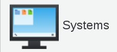
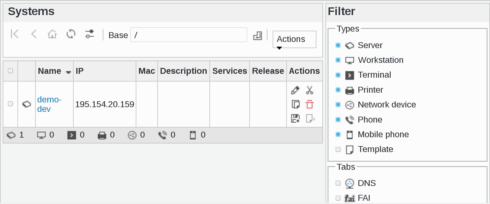
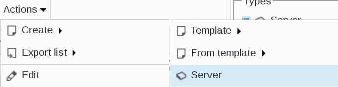
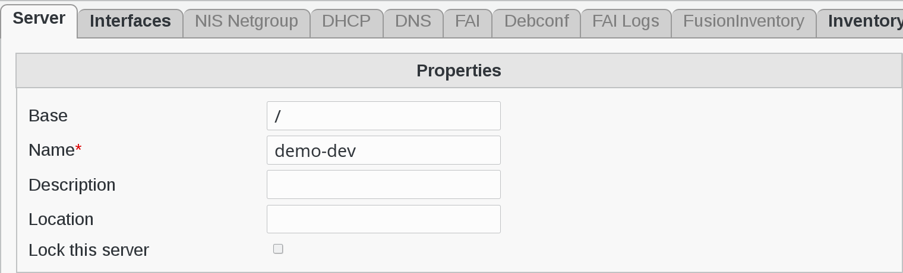
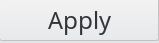
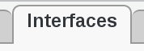
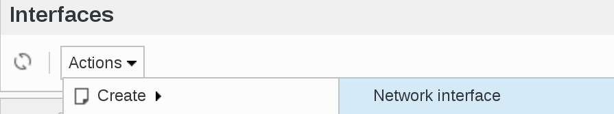
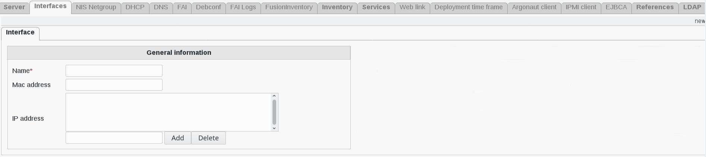

.. include:: ../../../globals.rst

Functionalities
===============

Create a system
^^^^^^^^^^^^^^^

Click on Systems icon on FusionDirectory main menu

You are now on Systems main page and we will create a server as an example

   
Click on Actions --> Create --> Server

   
You can now configure your server

   
Fill-in the following fields :

* **Base** : object base
* **Name** : the name of the server (required)
* **Description** : a short description of the server
* **Location** : the location of the server
* **Lock this server** : this will prevent the server from being reinstalled

Click on Apply button to save your data  

   
Interfaces
^^^^^^^^^^

We have aded a new useful feature in FusionDirectory which allows you to add one or more intrerfaces to your machine

Go to Interfaces tab 

Click on Actions --> Create --> Network Interface

   
You will arrive on Interface Configuration page

   
Fill-in the following fields :

* **Name** : interface name (required)
* **Mac address** : MAC address of the system
* **IP address** : IP addresses this system uses (v4 or v6)
