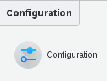
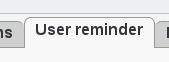
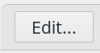
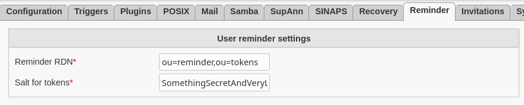
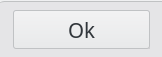

Configuration
=============

* How to configure User-Reminder plugin

Click on COnfiguration icon in FusionDirectory

Go to User reminder tab

   
Click on the edit button at the bottom right   

   
Fill-in user-reminder settings:

   * Reminder RDN : branch where the reminder tokens are stored
   * Salt for tokens : salt used to create the one time token used in the prolongation url
   

    
Click on "ok" to save your configuration

