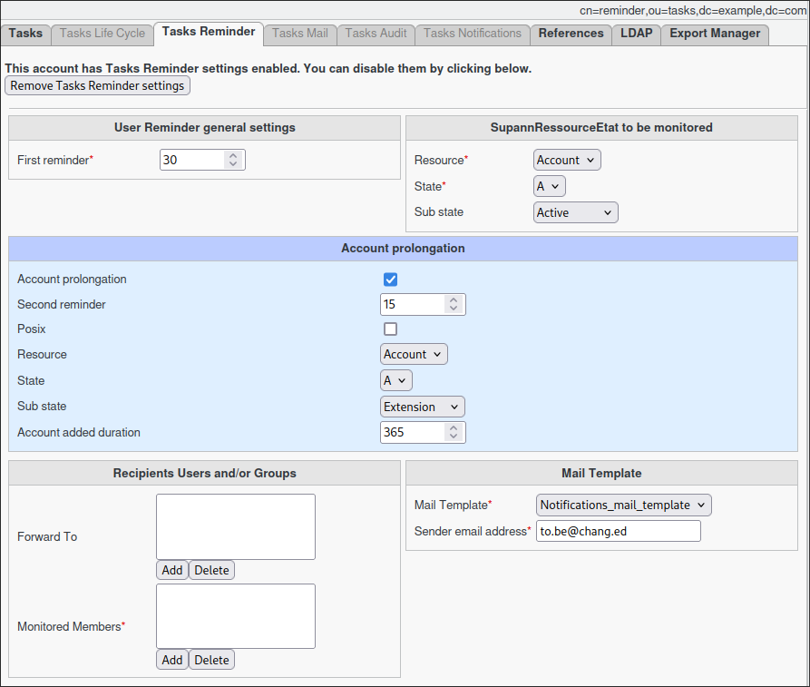

Reminder Task
=============

The **Reminder Task** manages account expiry notifications by monitoring the end date of a specified Supann resource.
It automatically sends email notifications to affected users, optionally including a link to extend their account validity.

.. note::
   This task must be used with **FusionDirectory Orchestrator** to function properly.

Task Setup
----------

Creating the Task
-----------------

1. **Open** the **Tasks** section in FusionDirectory.
2. **Define** the task’s schedule and repetition interval.

   .. image:: images/user-reminder-task-p1.png
      :alt: Reminder Task - Step 1: Task creation
      :width: 600px
      :align: center

Configuring the Reminder Task
-----------------------------

- **Navigate** to the **Tasks Reminder** tab.
- **Select** the Supann resource to monitor for expiration.
- **(Optional)** Enable the **account prolongation** feature.
  - This will provide a link to monitored members, allowing them to **extend** the specified Supann state.

If Account Prolongation is set
~~~~~~~~~~~~~~~~~~~~~~~~~~~~~~

- **Define** the prolongation settings for the specified Supann state.

  .. tip::
     You can specify an **alternate targeted resource** for specific or edge-case scenarios.

- **Set** the additional duration in days.

  - The specified number of days will be **added to the existing end date** of the monitored resource.

- **Assign** the members to be monitored.

  - If prolongation is enabled, they will receive an email with the extension link.

- **Assign** additional recipients within the **forward-to** to receive a copy of the email.

  - This can be useful for **management or administrative tracking**.

.. note::
   You can select either a **static group** or a **dynamic group** for greater flexibility.

Task Execution
--------------

For your configured task to be executed, you need to configure your **FusionDirectory Orchestrator Client**.

See :ref:`Reminder Task Execution <reminder-task-execution-label>` for more information.

Summary
-------

Once configured as described, the **Reminder Task** will:

- **Run daily** (or according to your configured schedule).
- **Analyze** the Supann resource for targeted users.
- **Send expiry notifications** to:
  - The affected users.
  - Any recipients listed in the **forward-to** list.

By ensuring timely reminders, this task helps maintain **active user accounts** while offering flexibility for organizational needs.
