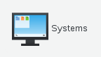
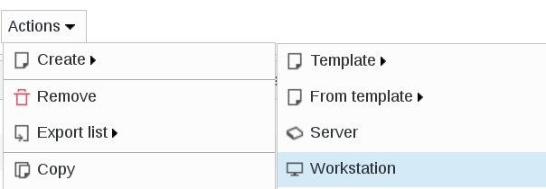
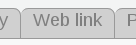
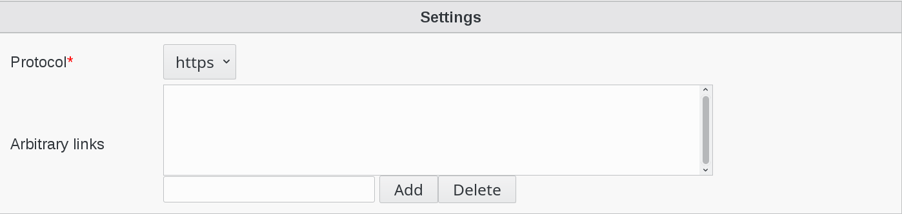
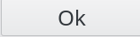

.. include:: /globals.rst

Functionalities
===============

* How to use the weblink plugin

Click on Systems icon in FusionDirectory

   

* Create a workstation

Click on Action --> Create --> Workstation 

   
Click on the web link tab

Click on Add Web link settings

   
Choose the protocol for your link   

   
Click on OK button bottom right to save   

