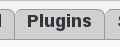
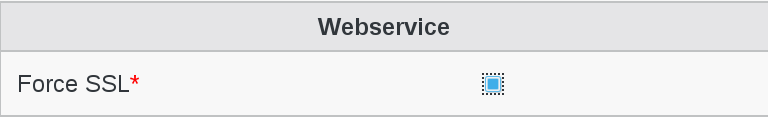

Configuration
=============

* Webservice configuration

Go to Configuration

.. image:: images/webservice-configuration.png
   :alt: Picture of Configuration icon in FusionDirectory

Open Plugins tab

Click on Edit button bottom right

   
«Force SSL» option is on by default, you can untick it if you want to call the webservice over HTTP

   
Click on OK button bottom right to save it         

