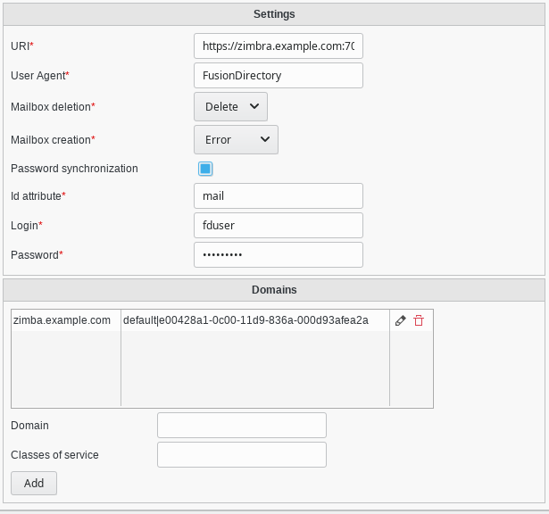
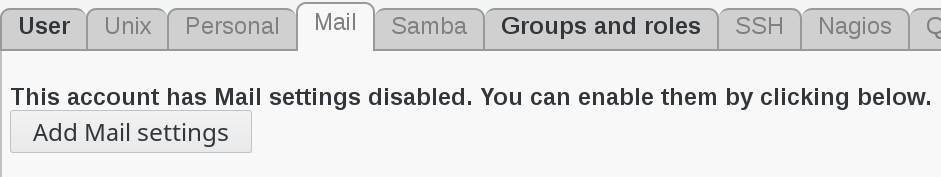

.. include:: /globals.rst

Functionalities
===============

Add Zimbra service
^^^^^^^^^^^^^^^^^^

Go to Systems

.. image:: images/zimbra-systems.png
   :alt: Picture of Systems icon in FusionDirectory

Create your server or edit an existing server

Click on services tab

Add the Zimbra service

Fill the fields for the Zimbra plugin and save it

* Global settings :

   * URI: Url of the Zimbra instance
   * User Agent: User agent to use to contact the API
   * Mailbox deletion: Should FD delete the mailbox when removing the account
   * Mailbox creation: Should FD error out or not when mailbox with the same email already exists
   * Password synchronization: Should FD sync the password to the zimbra account. Disable this if you have SSO.
   * Id attribute: Which LDAP attribute to use as email id. "mail" by default. If this is not "mail", "mail" will be added as an alias instead.
   * Login: Login to use to connect to the API
   * Password: Password to use

* Per domains settings :

   * Domain: mail domain ex: acme.com
   * Class of service: Service class name | cos id (zimbra cos id)

Click on "save" button bottom right to save your server

.. image:: images/zimbra-save.png
   :alt: Picture of Zimbra save button in FusionDirectory

Add Zimbra to a user
^^^^^^^^^^^^^^^^^^^^

Click on "users" button in FusionDirectory main page

.. image:: images/zimbra-users.png
   :alt: Picture of Users icon in FusionDirectory

Select a user

.. image:: images/zimbra-user.png
   :alt: Picture of User line in FusionDirectory

Go to Mail tab and click on "Add mail settings"

Fill in all the required information : mail account and other addresses and redirections

Click on "Apply" button bottom right to save your settings

