.. include:: /globals.rst

Create a user template
======================

Click on tab or icon Users, in the Users and groups section in FusionDirectory

.. image:: images/templates-users.png
   :alt: Picture of Users icon in FusionDirectory

Click Actions –> Create –> Template

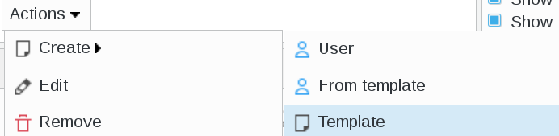
   
Depending on which other plugins you have installed, you can configure your template like you need. Below, you can find some exemple. 

You can find the documentation on how to create a macro here :ref:`fd-macros-label`.

User
----

The user tab is the base of your template, click on User tab

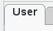
   
Generic User tab : this is the base tab to create a user template.

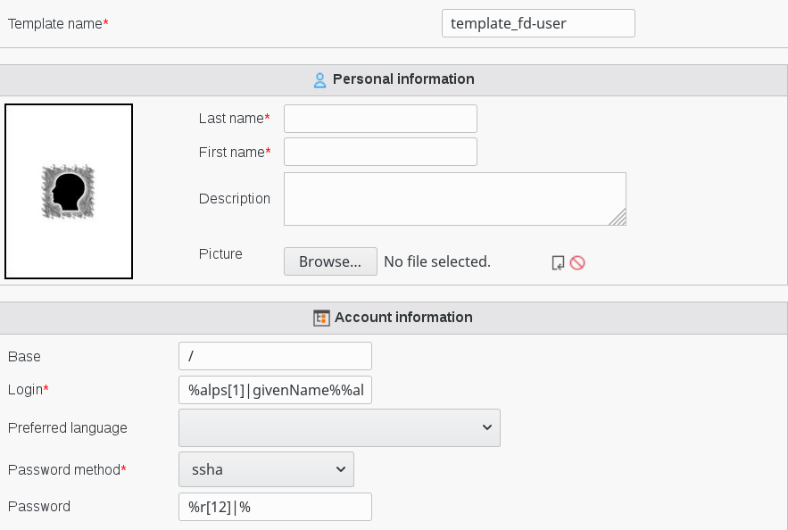
   
In this example we set the following macros to create a user :

  
* Login : **%alps[1]|givenName%%alp|sn%** meaning that login will be first letter of first name in low character followed by last name in low characters
* Password : **%r[12]|%** meaning that password will contain 12 random characters

Unix
----

When you are creating or editing your template, click on Unix tab Then click on Add Unix settings. A new dialog is opened

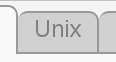

Then click on Add Unix settings. A new dialog is opened

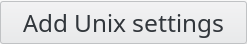
      
Fill-in Unix settings

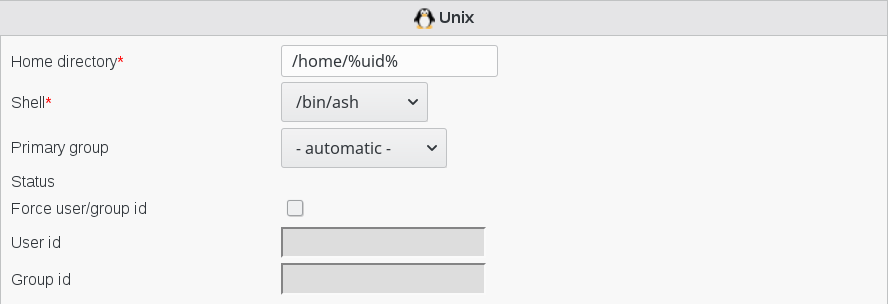
   
* Home directory : the path to the home directory of this user (required). 

You can use macro to automatically build the name of home directory users

For example : **/home/%uid%** 

Mail
----   

When you are creating or editing your template, click on Mail tab

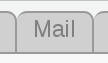

Then click on Add Mail settings. A new dialog is opened

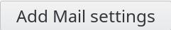
   
Fill-in Mail account settings

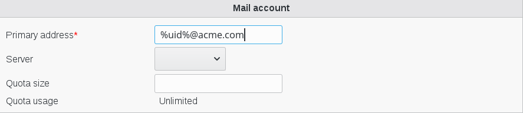
   
* Primary address : primary mail address (required)

You can use the macros to automatically build the name of mail user account.
 
In this example we set macro **%uid%@acme.com** meaning that the mail account will be userid@acme.com
   
Click on Ok button bottom right   

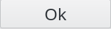
   
Now on the main page, on you template line, you will see the mail icon

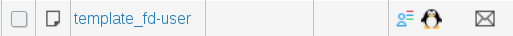
