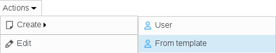
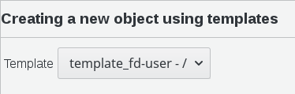
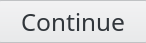
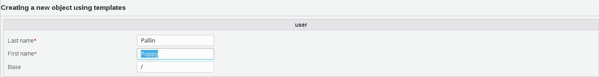
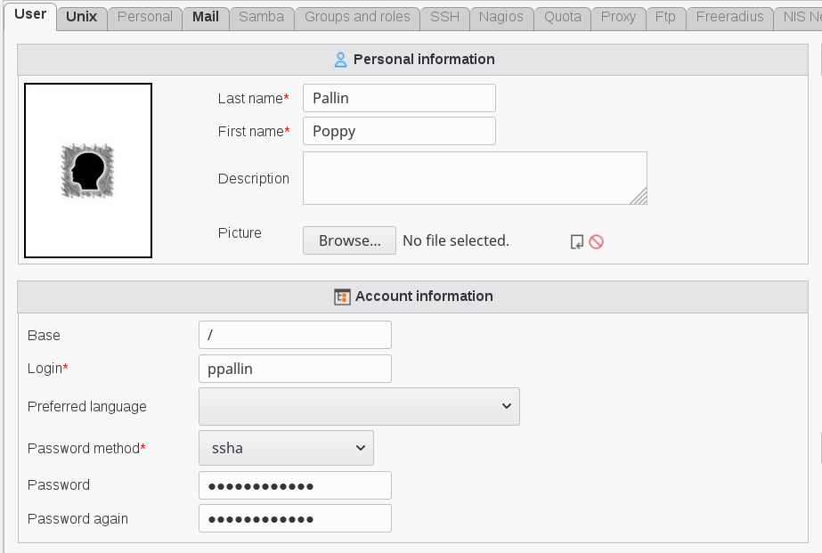
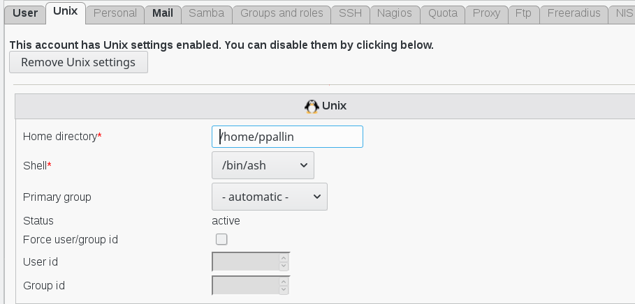
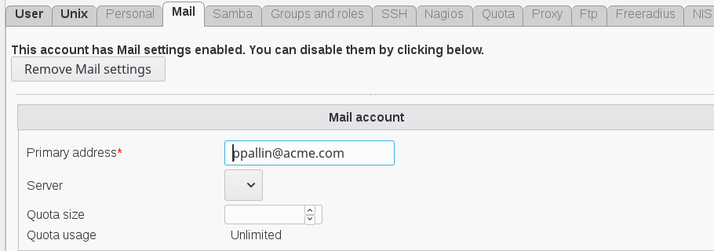

.. include:: /globals.rst

Use a user template 
===================

* How to apply a template

Here is an example of how templates works. 

We will take the most common example of creating a user from a template.

Click on tab or icon Users, in the Users and groups section in FusionDirectory

.. image:: images/templates-users.png
   :alt: Picture of Users icon in FusionDirectory
   
Click on Actions --> Create --> From template

   
A new page called Creating a new object using templates will appear. Choose the template the you wish to use from the drop-down menu

Click on Continue button bottom right

   
Fill-in the required information

* Last name : last name of this user (required)
* First name : first name of this user (required)
* Base : object base

Click on Continue button bottom right

   
You will now automatically see the User tab filled as per the macros you have put in your template.

See how to use macros : (url à mettre)

In this example, the user personal info look like this :

And the Unix info look like this :

And the Mail info look like this :

   
Click on Ok button bottom right

.. image:: images/templates-ok.png
   :alt: Picture of Ok button in FusionDirectory    
   
Now on the main page you can see the new user, with the Unix and Mail icons

.. image:: images/templates-new-user-entry2.png
   :alt: Picture of user line in FusionDirectory
