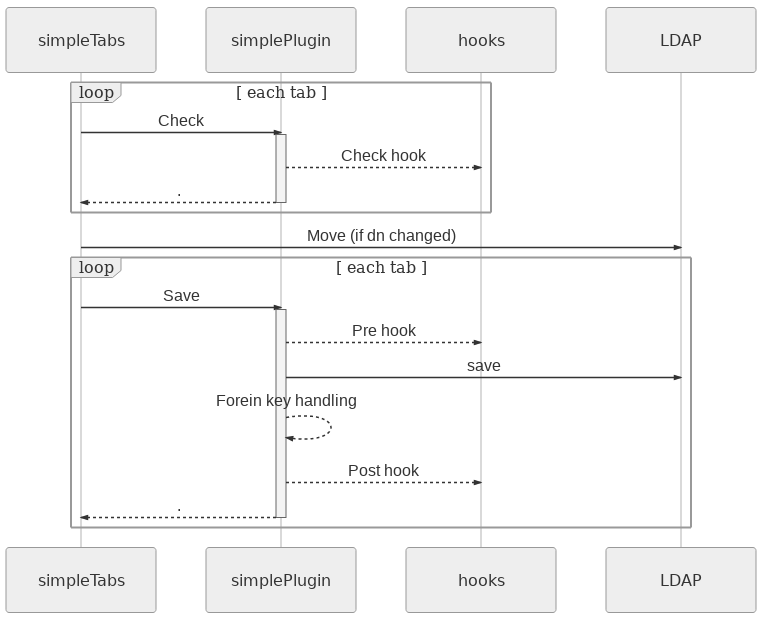

.. include:: /globals.rst

Functionalities
===============

All plugins can run external scripts when an action is triggered for creating, modifying or deleting. You can use pre and post events depending when you want to run the script. 

Pre triggers
------------

* **precreate** : Execute the script before creation.
* **premodify** : Execute the script before editing.
* **preremove**: Execute the script before removing.

The trigger works well and does not display information if it returns 0 
On error, prevents save and displays error.

Post triggers
-------------

* **postcreate** : Execute the script after creation.
* **postmodify** : Execute the script after editing.
* **postremove** : Execute the script after removing.

The hook works well and does not display information if it returns 0 
On error, displays command output.

Check triggers
--------------

* Execute the script in the check step (before saving), if it outputs anything, prevent save and show output as an error.

The trigger is considered to have passed if it returns 0 and does not display any message. 
(If it outputs anything it appears as a check failure, if it returns anything other than 0 it is considered a script error, 
for instance if the script was not able to do the check for some reason). 

LDAP attributes
---------------

You can use ldap attributes as command line options. See :ref:`fd-macros-label`.

LDAP arrays
-----------

If you put a var that is an array in the args of the hook, gosaAlternateMailAddress for instance, only the first value will be returned unless you use :ref:`array-modifiers`.

.. _triggers-special-variables:

Special variables
-----------------

* **%callerDN%** gives the DN of the author of the modification
* **%callerCN%** gives the CN of the author of the modification
* **%callerUID%** gives the UID of the author of the modification
* **%callerSN%** gives the SN of the author of the modification
* **%callerGIVENNAME%** gives the GIVENNAME of the author of the modification
* **%dn%** gives the dn of the modified object
* **%location%** gives the name of the location of the LDAP

On users you get these extra variables available: 

* **%userPassword%** to get password hash
* **%passwordMethod%** to get password method (usually ssha)
* **%passwordClear%** to get clear password
* **%userLocked%** to get user lock status (0 or 1)

Complete saving cycle
---------------------

When an object is saved, all check triggers are run first, then if no errors were returned, the plugin is moved if the dn changed, and then each tab is saved separately, running its precreate/premodify triggers, saving itself to the LDAP, and then running its postcreate/postmodify.
This means that when your trigger is called, the tabs after the one that triggered it are not saved yet.
Any trigger error (code returned other than 0) will interrupt the saving cycle.

There is no specific order between triggers on the same event of the same tab. If you need several triggers to run in a specific order on a same tab, call them from a script that you set as trigger, allowing you to control the order.

Also note that the save will only happen if something changed in the tab. If no data was modified, no saving is needed, and thus the triggers won’t get called.

