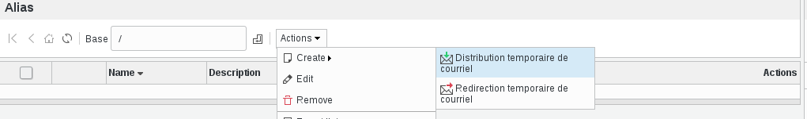
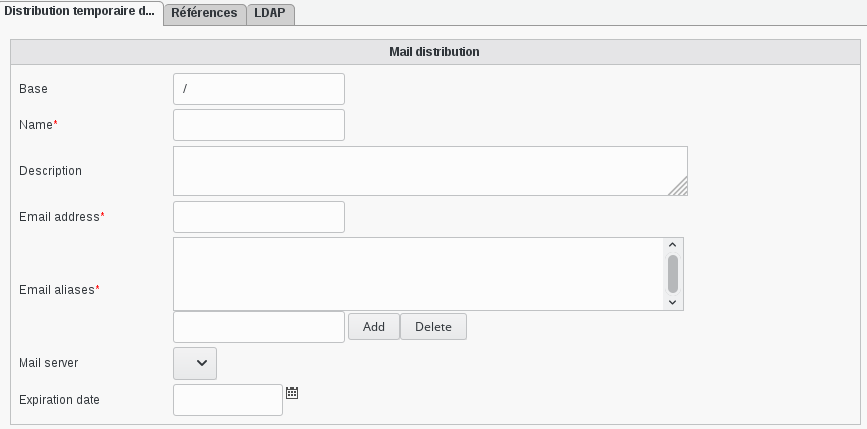
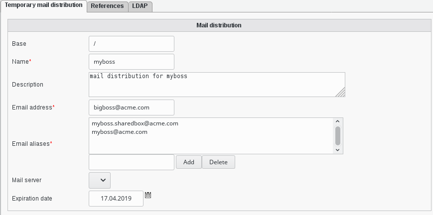
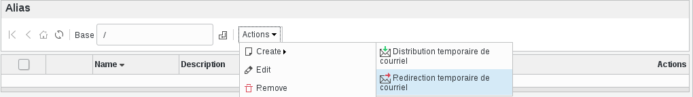
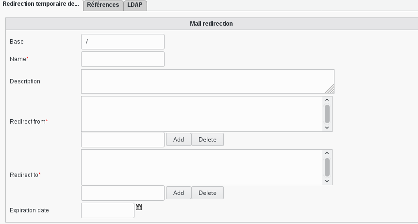
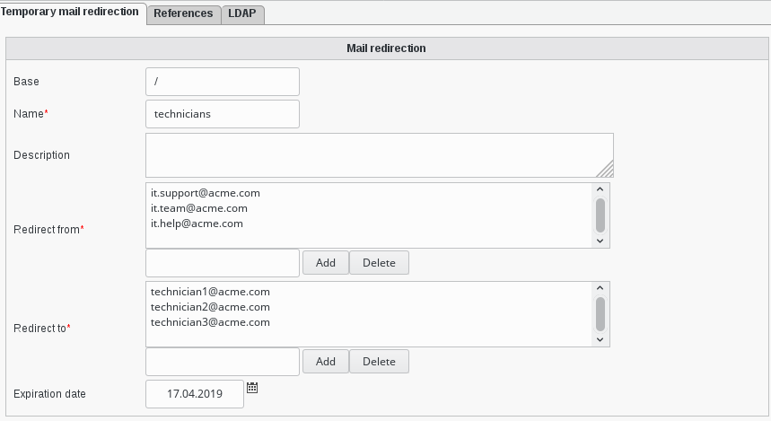
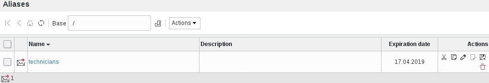

.. include:: /globals.rst

Functionalities
===============

* Alias create temporary mail

 For example, we need that all mails send to:

* myboss.sharedbox@acme.com (mail attribute)
* myboss@acme.com (gosaMailAlternateAddress)

are delivered to:

* bigboss@acme.com (mail Attribute) mailbox on mailbox.server.com (gosaMailServer)

  Click on the 'Aliases' entry or icon, in administration section, to join the 'Alias management' page.
  Now you can add a new Mailbox distribution via 'Actions –> Create –> Temporary Mail distribution' (or modify the existing ones)

   
A new dialog is open:    

* Alias create temporary mail wiew

   

* Base: Object base   
* Name: Name to identify this alias (required)
* Description: Description of this alias
* Email address: Email address (required)
* Email aliases: Aliases of this email address (required)
* Mail server: Mail server for this alias (required)
* Expiration date: Date after which the distribution should be deleted. Leave empty for no deletion.

* Alias create temporary mail redirection

 For example we need to forward (duplicate and send) all mails send to :

* it.support@acme.com
* it.team@acme.com
* it.help@acme.com

towards:

* technician1@acme.com
* technician2@acme.com
* technician3@acme.com

    Click on the entry or on the icon in administration section to join the 'Alias management' page.
    Now you can add a new Mailbox redirection via 'Actions –> Create –> Temporary Mail redirection' (or modify the existing ones): 

   
* Alias create temporary mail redirection view

   
* Base: Object base   
* Name: (required) Name to identify this redirection.
* Description: Description of this redirection.
* Redirect from: (required) Mail address from which you want to redirect. This means the mail alias.
* Redirect to: (required) Destination of this redirection.
* Expiration date: Date after which the redirection should be deleted. Leave empty for no deletion. 
   
Fill the required information, for the above example : 

* Alias create temporary mail redirection filled

   
      

