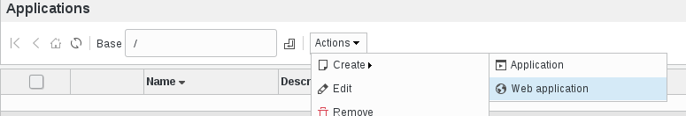
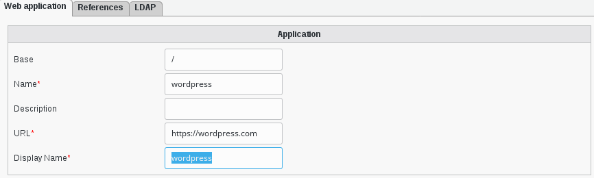
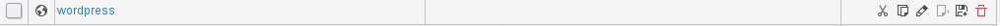
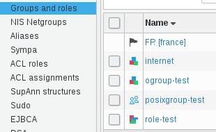
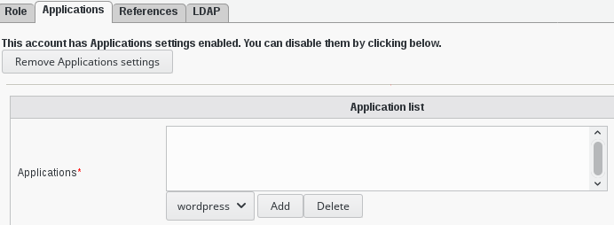
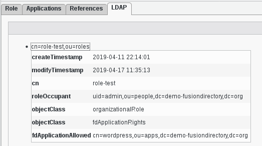
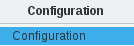
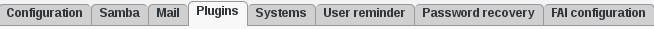
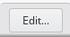

.. include:: /globals.rst

Functionalities
===============

Add a web application
^^^^^^^^^^^^^^^^^^^^^

   
A new dialog box will open, fill the forms and save your application :

* Base: where is the application entry in the LDAP
* Name: applications name
* Description: description of the application
* URL: URL of the application
* Display Name: the name that we display (FusionDirectory portal)
* Set your icon for you application (FusionDirectory portal)

   
Click "ok", and you will see the wordpress line created in the application

   

Now, if you click on the menu entry "Groups and roles" on the left, you will find a "role-test" group

   
If you click on the role-test group, you will see the Applications tab   
   

   

Click on the entry that you created before and click "add", and you will see your webapplication added

Now go to LDAP tab and click on the entry you see

   
   
This will give you an overview of attributes **fdApplicationAllowed** that you will be able to use in a filter to restrict who can login

Use FusionDirectory as portal
^^^^^^^^^^^^^^^^^^^^^^^^^^^^^

* Activate portal mode

Go in configuration 

   
   
Click on plugins section and then click edit in the bottom right corner

   
   
