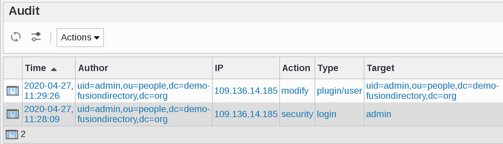

.. include:: /globals.rst

Functionalities
===============

* Audit list

* Create a filter

.. image:: images/audit-filter.png
   :alt: Picture of Audit create a filter in FusionDirectory

* Audit filter result

.. image:: images/audit-filter-result.png
   :alt: Picture of Audit filter result in FusionDirectory
   
* Audit event

.. image:: images/audit-event.png
   :alt: Picture of Audit event in FusionDirectory
   
If you click on the author icon, you will get the author information

* Audit author

* Security Audit

Click on Users icon on FusionDirectory main page

Click on the user you want show the security audit data

Go to Security tab

   
You will now see the Security audit data for this user

   
In this example, you can say that User dufour paul (**Author**) has signed-in (**Event**) and successfully logged-in (**Result**) from IP address 109.136.14.185 (**Origin**) 33 minutes ago (**Time**)
