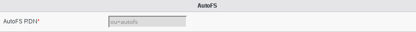

Configuration
=============

If you need to modify something, you can access to FD configuration of the plugin by the 'Configuration' icon or entry in the 
'Addons' section of the main page of FD GUI: 

.. image:: images/autofs-configuration.png
   :alt: Picture of Autofs configuration in FusionDirectory
   

Access to configuration is read-only. If you need to make changes, then you must press the 'Edit' button at the bottom right of the window.    

   

   
