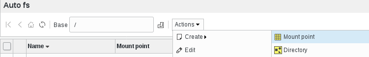
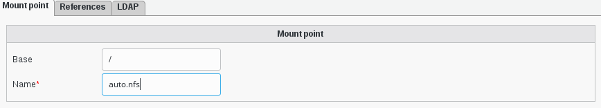
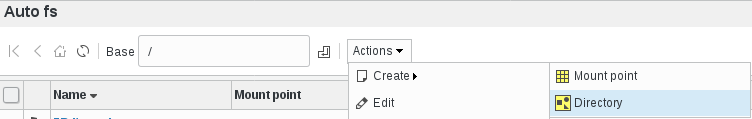
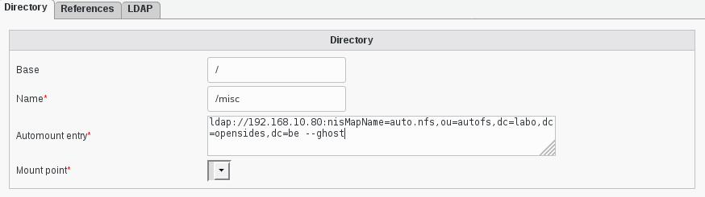
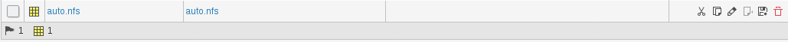

Functionalities
===============

In your FusionDirectory web interface you have now, in the “Administration” section, a new tab and a new icon called “Autofs” that you can use 
to manage auto-mounts in your infrastructure : 

   
   
* Create Mount Point

   
   
Fill the different informations and click on ok to save it. 

   
   
* Create a directory 

   
      
  

   
   
Fill the different informations and click on ok to save it. 

   

   

