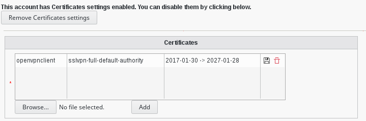

.. include:: /globals.rst

Functionalities
===============

* Add a certificate

Select an user an click on certificate tab

.. image:: images/certificates-tab.png
   :alt: Picture of Certificates tab in a user in FusionDirectory

* Activate certificate tab

* Add a browsable crt or pem certificate

   
   
* Problems with functions

If you see an error message that not found the next function:

.. code-block:: bash

   openssl_x509_parse()
   

Try to edit your “/etc/php/php.ini” and uncomment “extension=openssl.so”

To finish, restart your webserver.        

