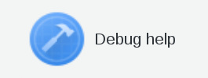
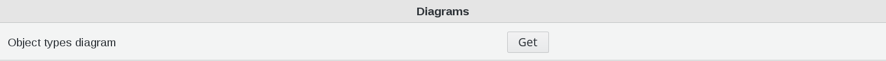
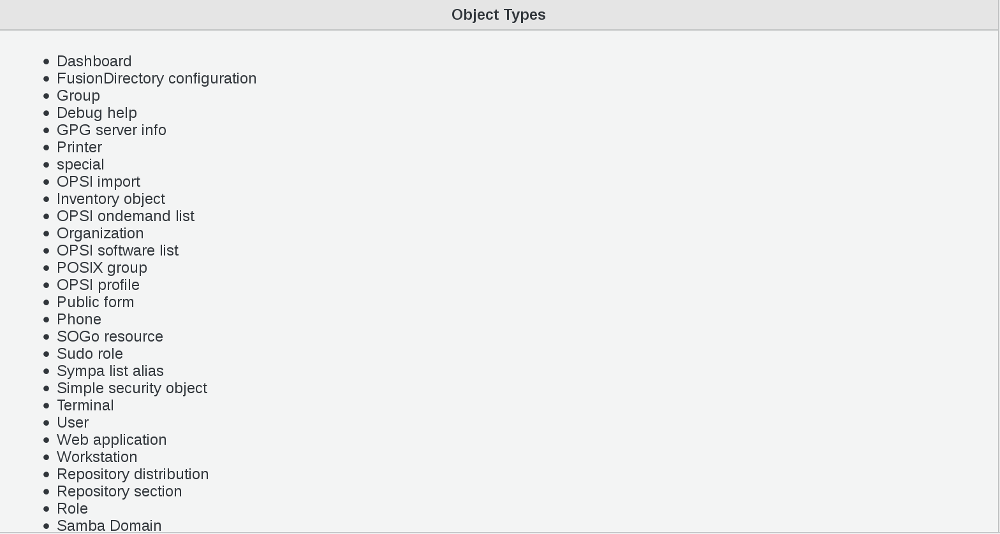
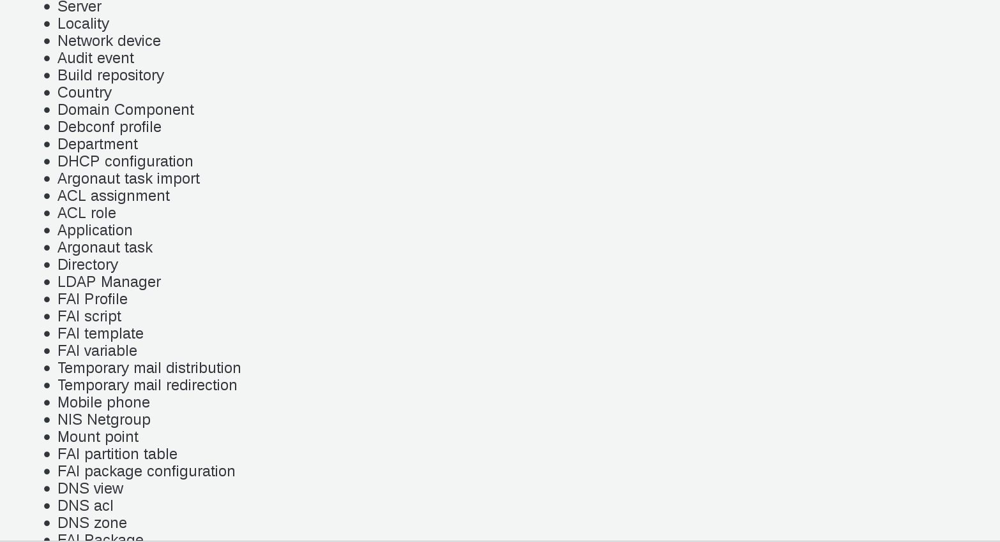
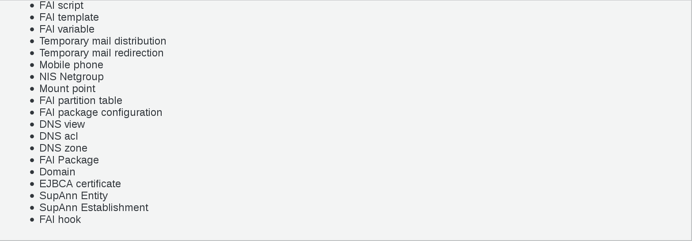
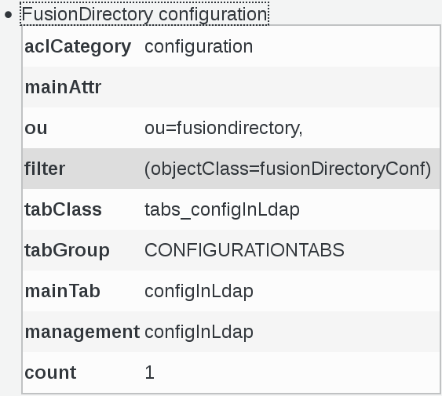

.. include:: /globals.rst

Functionalities
===============

* Debug help

In the Reporting section in FusionDIrectory, click on Debug help icon

You can download a diagram and see the content of all object types

   

When you click on an object type, in this example FusionDirectory configuration, you can see the content of this object

