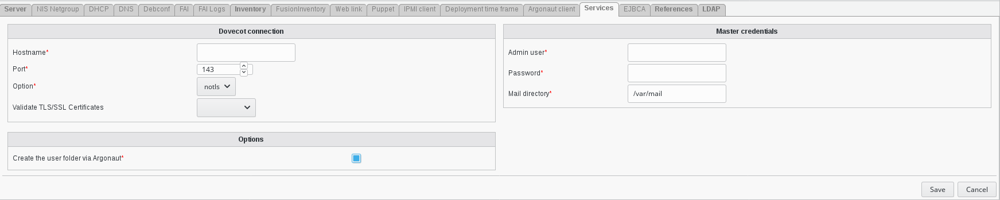

.. include:: /globals.rst

Functionalities
===============

* Add Dovecot service

Go to Systems

* Create your server or edit an server 

   
   
Click on services tab    

.. image:: images/dovecot-services.png
   :alt: Picture of Dovecot services in FusionDirectory
   
   
Add Dovecot service   

   
   
   
Fill the fields for the Dovecot plugin and save it:

    * Hostname: the hostname of the server
    * Port: port for the connexion
    * Option: tls or not
    * Validate certificate: if we validate the certificate or not
    

   
   
Click on ok to save your server     

   
   
         
    
   
