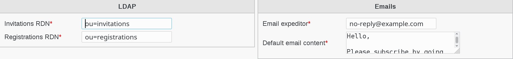

Configuration
=============

Click on Configuration icon on FusionDirectory main page

.. image:: images/invitations-configuration.png
   :alt: Image of Configuration icon in FusionDirectory
   
Go to Invitations tab   

   
Click on Edit button bottom right

.. image:: images/invitations-edit-button.png
   :alt: Image of Edit button in FusionDirectory

You are now able to configure Invitations parameters

LDAP configuration
------------------

* **Invitations RDN**: Defines the branch in which invitations objects will be stored
* **Registrations RDN**: Defines the branch in which registrations objects will be stored

Emails configuration
--------------------

* **Email expeditor**: the e-mail address used to send invitations e-mails. Be careful to select an address that your server can send from without being flagged  as spam (required)
* **Default email content**: Default content of e-mail sent invitations (required)
