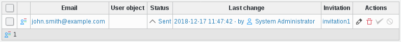
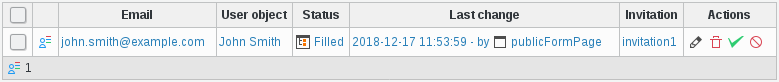
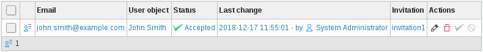

Functionalities
===============

Invitation
----------

You can create an invitation for any form you created from the Public Forms plugin.

Properties
++++++++++

* **Base**: The LDAP branch is which this invitation will be stored
* **Name**: A name to identify this invitation
* **Form**: The form to show for this invitation
* **Email subject**: The subject of the sent email
* **Email content**: The content of the sent email
* **Author**: Shows the author of this invitation

Sending invitations
+++++++++++++++++++

To actually send invitation you need to fill the second section on the right.

* **Reply to**: This is the email address which will be put in the Reply-To header, it defaults to the email address of the connected user
* **Emails**: This contains the email recipient you want to send an invitation to, if any

Registrations
-------------

Sent
++++

Once you invited some people, a registration object is created for each of them, which stores the state of his registration.

A registration contains a few informations:

* **Email**: The email address the invitation was sent to
* **User object**: A link to the user object once the registration is filled
* **Status**: The status of this registration, one of: Sent, Filled, Accepted, Rejected
* **Last change**: The date and time of the last modification and its author
* **Invitation**: A link to the invitation object

Filled
++++++

Once a invitation is used and the form is correctly filled:

* A user object is created using the template.
* This user is locked and has the fdUserRegistration objectClass.
* This user is stored in the base indicated in the form object, under a similar tree as the one its invitation is stored at.
* The registration state is changed to Filled.

Then, a manager or administrator needs to accept or reject the registration.

Accepted
++++++++

If the registration is accepted:

* The user object is unlocked.
* It’s moved to the same base as its invitation.
* The objectClass fdUserRegistration is removed.
* The registration state is changed to Accepted.

Rejected
++++++++

If the registration is rejected:

* The user object is deleted.
* The registration state is changed to rejected.
