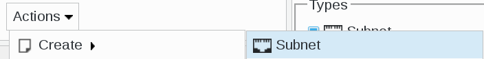
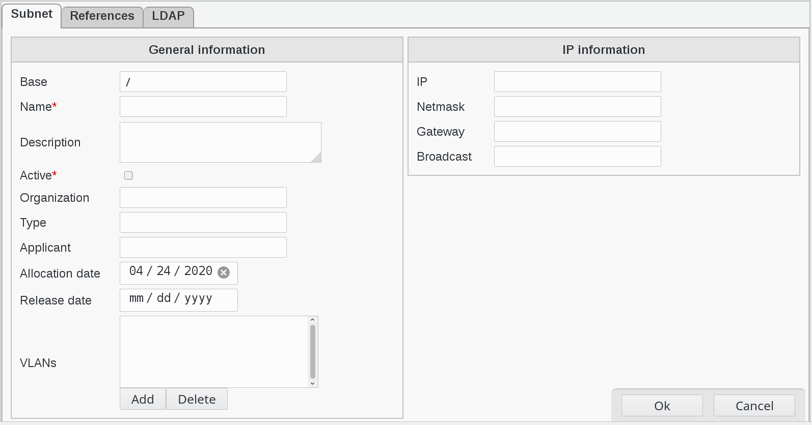
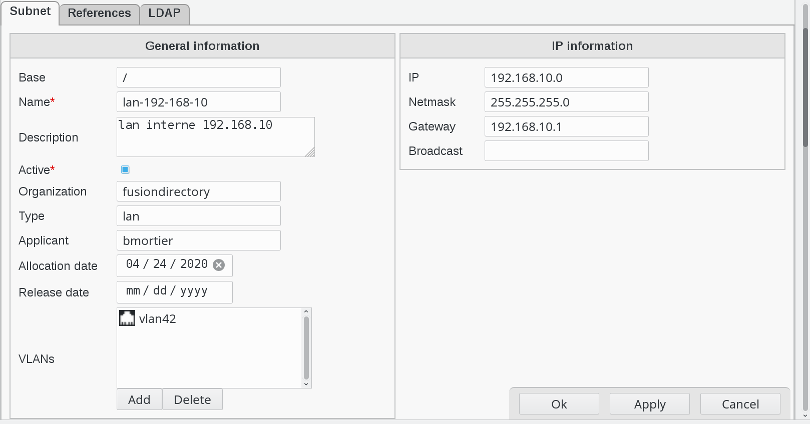
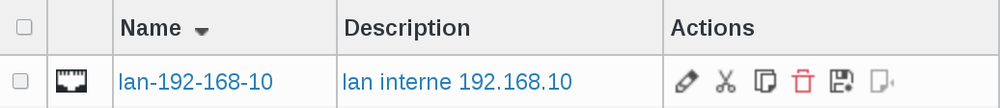
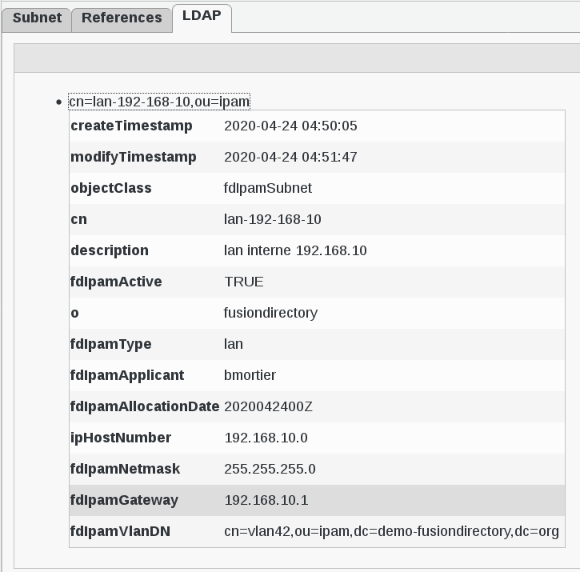
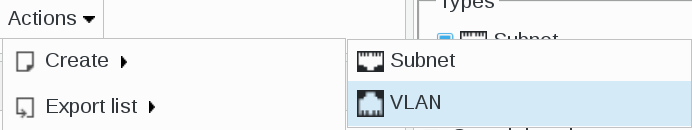
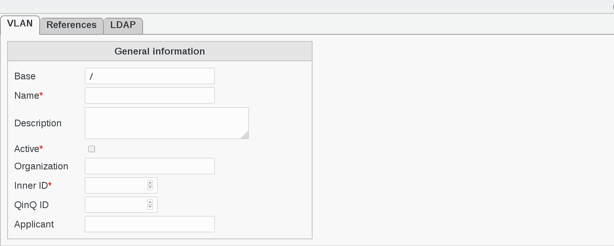
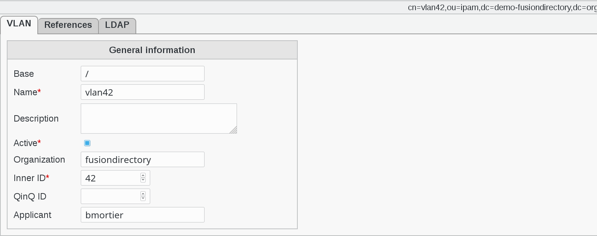
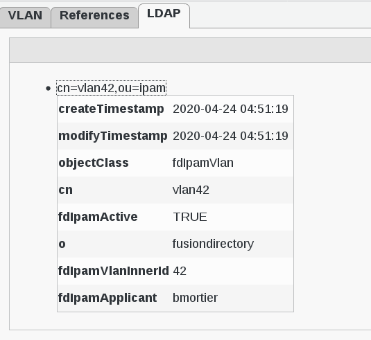

.. include:: ../../globals.rst

Functionalities
===============

Create a subnet
^^^^^^^^^^^^^^^

Click on Ipam icon in FusionDirectory 

On Ipam main page, click on Actions --> Create --> Subnet

This will bring you to subnet configuration page     

   
Fill-in the following fields :

* **Base** : object base
* **Name** : subnet name (required)
* **Description** : descriotion of this simple securyty object
* **Active** : is this subnet active (required)
* **Organization** : subnet organization
* **Type** : subnet type
* **Applicant** : applicant
* **Allocation date** : allocation date
* **Release date** : release date   
* **VLANs** : VLANs linked to this subnet
* **IP** : subnet IP
* **Netmask** : subnet netmask
* **Gateway** : gateway IP
* **Broadcast** : Broadcast IP

.. note::

   You can attach multiple VLANs to a subnet.
      

Example of Subnet
^^^^^^^^^^^^^^^^^

When you are done, click on Apply button bottom right to save your subnet     

.. image:: images/ipam-apply-button.png
   :alt: Picture of Apply button in FusionDirectory 

Then, click on OK button. This will bring you back to Ipam main page

   
You can now see you just created subnet in the list

   
If you click on your subnet line and go to LDAP tab, you will see LDAP attributes

  

Create a VLAN
^^^^^^^^^^^^^

On Ipam main page, click on Actions --> Create --> VLAN

This will bring you to VLAN configuration page     

   
Fill-in the following fields :

* **Base** : object base      
* **Name** : subnet name (required)
* **Description** : description of this simple security object
* **Active** : is this subnet active (required)
* **Organization** : subnet organization
* **Inner ID** : inner VLAN ID (required)
* **QinQ ID** : QinQ ID VLAN ID
* **Applicant** : applicant

Example of VLAN
^^^^^^^^^^^^^^^

When you are done, click on Apply button bottom right to save your vlan

.. image:: images/ipam-apply-button.png
   :alt: Picture of Apply button in FusionDirectory 

Then, click on OK button. This will bring you back to Ipam main page

   
You can now see you just created vlan in the list

   
If you click on your VLAN line and go to LDAP tab, you will see LDAP attributes

