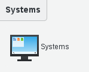
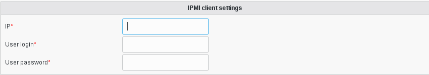

.. include:: /globals.rst

Functionalities
===============

* How to add an Ipmi client

Go to Systems

* Edit a server 

Click on Ipmi client tab 

   
   
Click on Add Ipmi client settings button

   

Fill IP, user login and user password Click on ok to save it    

   
   
   
   
   
   
   
   
   
      
