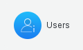
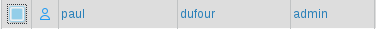
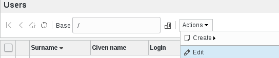
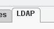
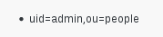
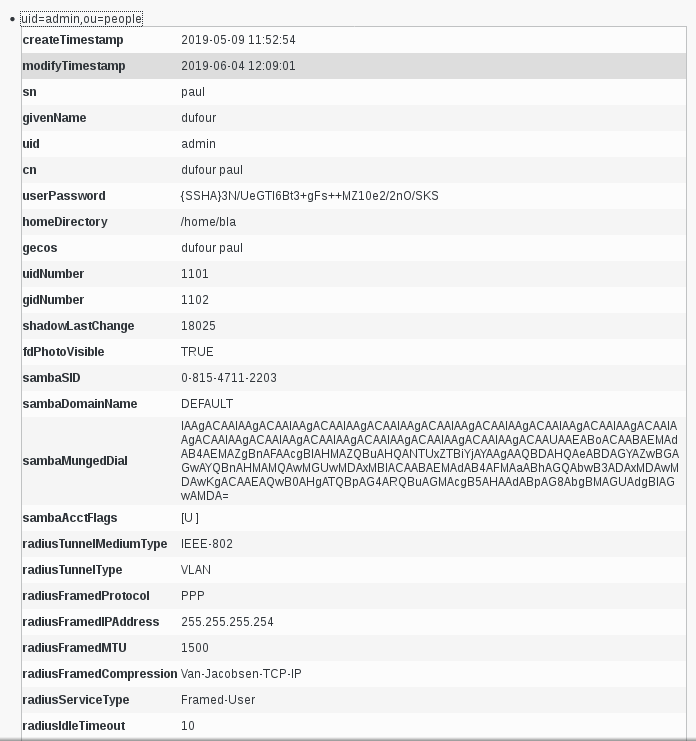

.. include:: /globals.rst

Functionalities
===============

* How to use the LDAP Dump plugin

Click on Users icon in FusionDirectory

Select a user by thicking the little box 

Click on Actions --> Edit

Go to LDAP tab at the bottom

   
In the LDAP tab, you can see the DN of your element

If you click on your element, you will see all the informations that the LDAP contains   
       

