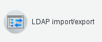
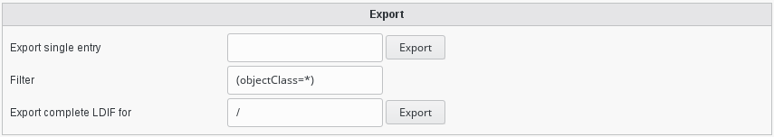
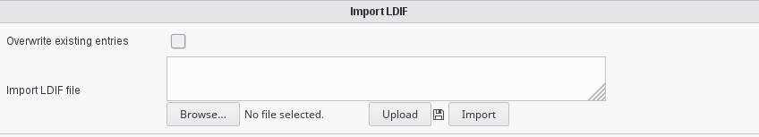
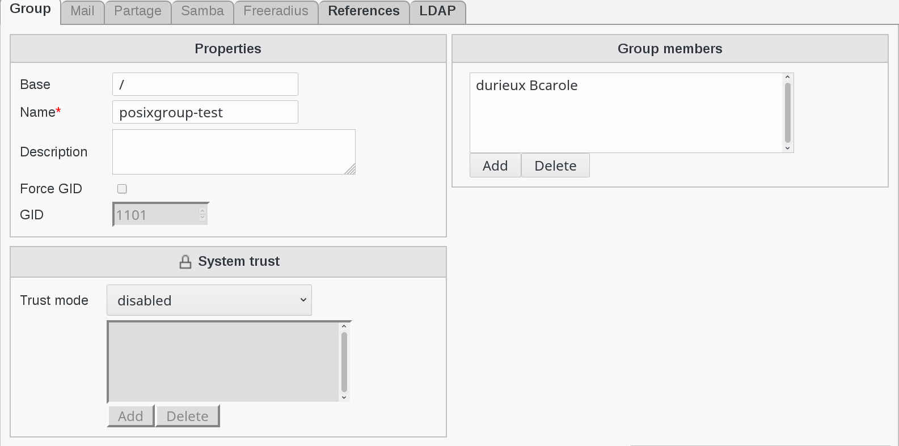
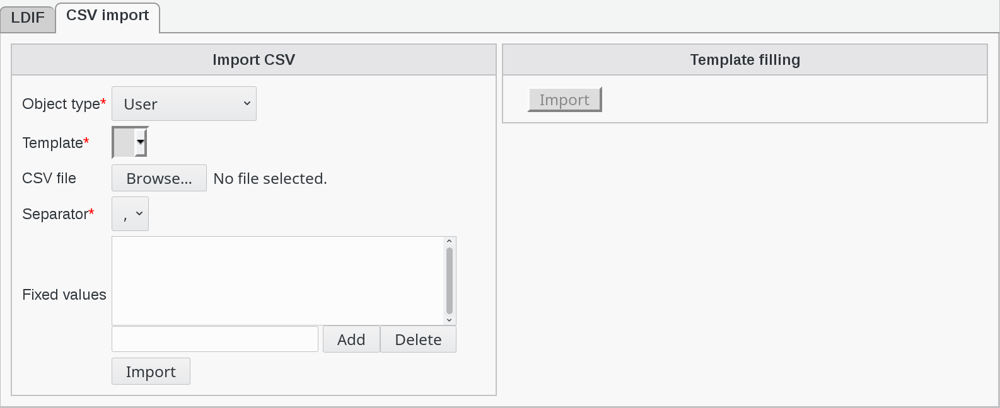

.. include:: /globals.rst

Functionalities
===============

In your FusionDirectory web interface you have now, in the Configuration section, a new tab and a new icon called “Ldap import/export” that you can use to manage ldif in your infrastructure : 

   
When you click on this tab or icon, then you can:

    * Export ldif
    * Import ldif
    * Import CSV
   
* Export ldif

The LDIF export plugin provides methods to download a complete snapshot of the running LDAP directory as ldif. You may save these files for backup purpose or when initializing a new server. 

   
"Export single entry" allows you to export a single ldap record. For example, in my ldap directory, if I ask to export the sales group:

.. code-block:: bash

   cn=sales,ou=groups,dc=opensides,dc=be
   
the result is an ldif file with this content: 

.. code-block:: bash

   dn: cn=sales,ou=groups,dc=opensides,dc=be
   cn: sales
   gidNumber: 1105
   memberUid: Homer.Sympson
   memberUid: gmarquez
   objectClass: top
   objectClass: posixGroup
   
"Export complete LDIF for" allows you to export all records of your ldap directory.

* Import ldif

The LDIF import plugin provides methods to upload a set of entries to your running LDAP directory as ldif. You may use this to add new or modify existing entries. Remember that FusionDirectory will not check your ldifs for FusionDirectory conformance. 

   
* Import LDIF File (Modify existing objects, keep untouched attributes)  

For example, in FusionDirectory, I have this posixgroup-test group: 

which corresponds at this entry in my ldap directory: 

.. code-block:: bash

   dn: cn=posix-group,ou=groups,dc=opensides,dc=be
   cn: posix-group
   gidNumber: 1105
   memberUid: durieux.Bcarole
   objectClass: top
   objectClass: posixGroup
   
* CSV import

The CSV import plugin provides methods to generate user accounts from a file containing Semi-Colon Seperated Values. The administrator can decide which columns should be transfered to which attribute and select a template to apply.    

Note that the file must not contain a header line, all lines are treated as data to import, except if they start with a #.    
      
   

 
