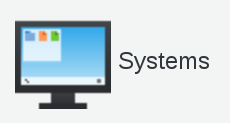
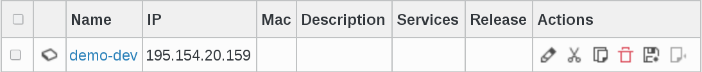
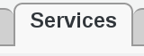
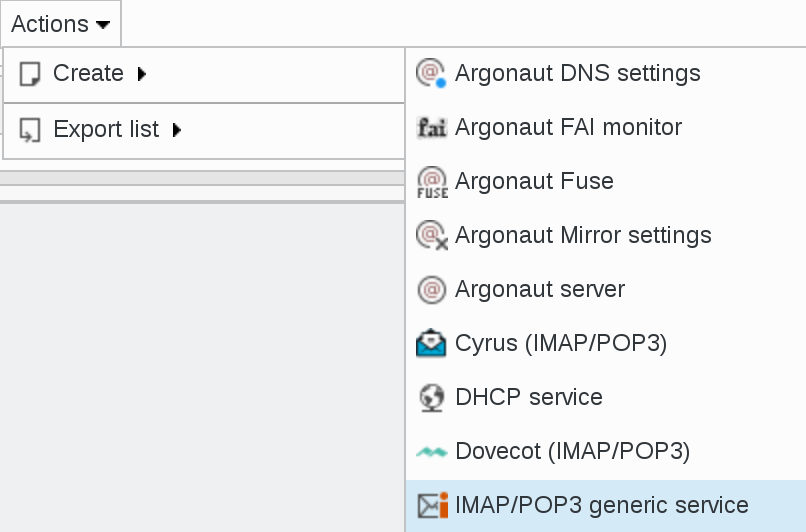
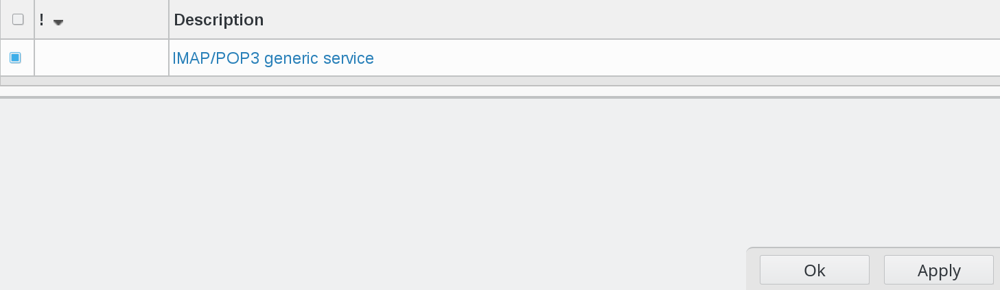
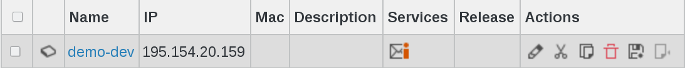

.. include:: /globals.rst

Functionalities
===============

Basic service provided
^^^^^^^^^^^^^^^^^^^^^^

* Services installed

From now, you have this new services available for every system server:

IMAP/POP3 generic service.

Click on Systems icon in FusionDirectory

Select a server (in this example demo-dev)

Go to Services tab

In the drop-down menu click on Actions --> Create --> IMAP/POP3 generic service

   
If you choose this service, a new dialog is opened 

You just need to click on "Save" button bottom right   

   
Click on Apply button   

   
Now, in services column, you can see the imap/pop3 icon 

