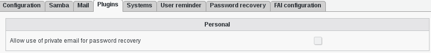

Configuration
=============

If you need to modify something, you can access to FD configuration of the plugin by the 'Configuration' icon or entry in the 
'Addons' section of the main page of FusionDirectory Configutation Interface: 

.. image:: images/personal-configuration.png
   :alt: Picture of Personal configuration in FusionDirectory
   
You can thick the "Allow use of private email for password recovery" option, so that the personal address can be used for password recovery: configuration -> plugins -> personal in FusionDirectory   

   
   
   
   
   
   
   

