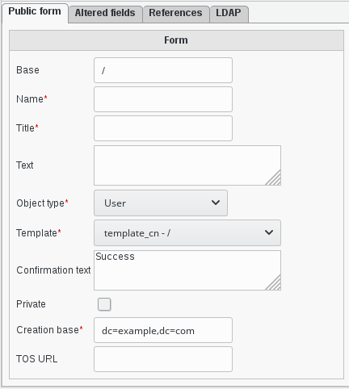
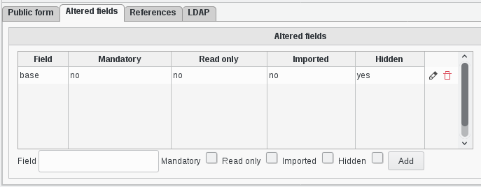

Functionalities
===============

You can manage forms in the «Public Forms» entry from the main menu.

Public Form
-----------

* **Base**: The LDAP base this form will be stored into
* **Name**: A name to identify this form
* **Title**: A title to display in this form page
* **Text**: A text to show before this form
* **Object type**: The type of object this form will create
* **Template**: The template to use for this form
* **Confirmation text**: The confirmation text shown once the form is successfully submitted
* **Private**: This is only useful if the invitations_ plugin is installed and will make this form only available with a valid invitation
* **Creation base**: The base the created object will be placed in
* **TOS URL**: If filled, a mandatory checkbox will force people to accept the terms of service available at this URL before submitting the form

Altered fields
--------------

The form will be built from the template, and all asked fields from the template will be shown by default.

In this tab you can alter how some of these fields behave, either by hiding them, or making them mandatory, or imported.
Making them imported is only useful if you use a setup which fills HTTP headers with values for those fields. If a field is marked as read-only and mandatory but has no value it will be writable to avoid a lock out.
