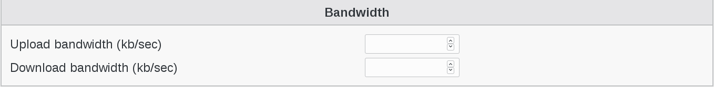
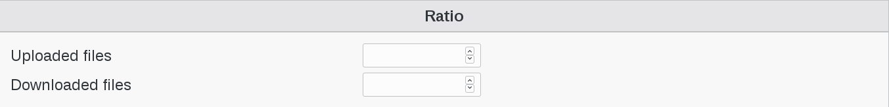
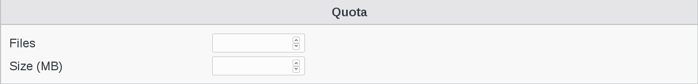
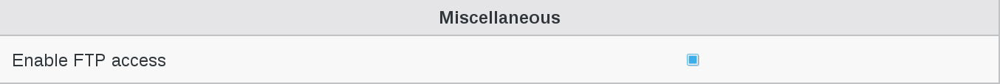

.. include:: /globals.rst

Functionalities
===============

* Create Pureftpd User

In order to create a pureftpd user, you need to have a valid pureftpd server in your structure environnement. 

Click on existing user or create a new one

Click on “Ftp” tab

   
Click on "Add Ftp settings" button 

   
Fill the desired fields

   
Bandwidth :

   * Upload bandwidth (kb/sec) : Maximum upload bandwidth in Kb/sec
   * Download bandwidth (kb/sec) : Maximum download bandwidth in Kb/sec 

   
Ratio :

   * Uploaded files : Defines upload ratio
   * Downloaded files: Defines download ratio
   

   
Quota :

   * Files : restrict the maximum number of files of a user directory
   * Size (MB) : restrict the maximum size, in MB, of a user directory
   

   
Miscellaneous :

   * Enable FTP access : thick the box if needed
   
   
Click on "Apply" button bottom right to save your settings

   
   

   
